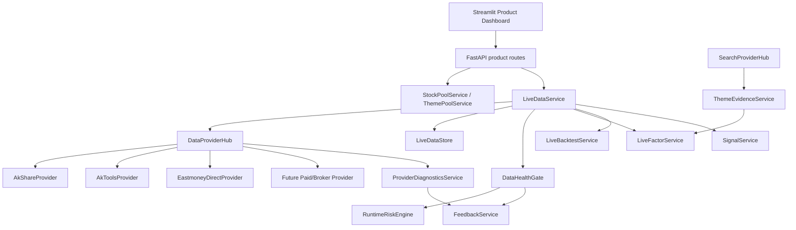

# A股主板实盘数据闭环架构设计

> 角色：Architect Agent  
> 日期：2026-06-10  
> 输入需求：`docs/requirements/2026-06-10-a-share-live-data-closed-loop-requirements.md`  
> 输出目的：为 Developer Agent 提供模块边界、接口契约、实现逻辑、测试策略和分阶段开发指导。

---

## 1. 架构目标

本阶段目标是把当前产品从“Demo fallback 可演示”升级为“A股主板真实数据闭环 MVP”。系统必须让自选池和 AI算力/半导体主题池在真实数据源上完成：

1. 实时行情盯盘。
2. 历史日线拉取、缓存和质量检查。
3. 基础财务数据拉取、缓存和缺失报告。
4. 主题/新闻证据增强。
5. 因子计算、回测、信号生成共享同一套真实数据上下文。
6. 数据异常时 fail closed，禁止实盘信号和订单草稿。

本设计不启用真实自动交易，不新增 LEVEL_3 入口，不绕过 Risk Agent、股票池过滤器、人工确认下单和系统安全不变量。

---

## 2. 需求映射

| 需求 ID | 架构模块 | 说明 |
|---|---|---|
| F-001 | `DataProviderHub` + provider adapters | 统一 AkShare、AkTools、Eastmoney direct 等真实源 |
| F-002 | `ProviderDiagnosticsService` + API/UI | provider 级诊断、字段覆盖率、延迟、错误 |
| F-003 | `DataProviderHub.fetch_with_fallback()` | 按优先级自动切换，记录 fallback chain |
| F-004 | `DataHealthGate` | 全部真实源失败时 fail closed，阻断信号和订单草稿 |
| F-005 | `StockPoolService` | 自选池管理和 A股主板过滤 |
| F-006 | `ThemePoolService` | AI算力/半导体主题池和标签 |
| F-007 | `LiveDataService.get_realtime_quotes()` | 真实实时行情闭环 |
| F-008 | `LiveDataService.get_daily_bars()` + storage | 历史日线、raw/adjusted price、复权方式 |
| F-009 | `LiveDataService.get_fundamentals()` | 基础财务字段和缺失报告 |
| F-010 | `ThemeEvidenceService` + search providers | 新闻、公告、研报证据，结构化标签 |
| F-011 | `ProviderFailureAnalyzer` | provider 失败时搜索诊断并写入 feedback |
| F-012 | `IntradayBarProvider` contract | 分钟线接口预留，不作为 MVP 阻断 |
| F-013 | `DataHealthGate` + `RuntimeRiskEngine` | 数据健康门禁进入信号链路 |
| F-014 | `product_routes.py` + `product_dashboard.py` | 统一网页入口 |
| F-015 | `FeedbackService` | provider 异常、字段缺失、fail closed 写 Bug |

---

## 3. 当前系统约束

### 3.1 已有能力

- `src/product_app/market_data.py` 已有产品侧行情门面，但目前只覆盖实时行情，且会 fallback demo。
- `src/data_gateway/realtime_provider.py` 已实现 AkShare 实时行情映射和 A股/港股字段标准化。
- `src/data_gateway/aktools_provider.py` 已有 AkTools HTTP provider。
- `src/api/product_routes.py` 已有 `/product/quotes`、Dashboard、jobs、feedback 等 API。
- `src/product_app/service_manager.py` 已能运行 `quote_refresh` 后台作业。
- `src/agent_orchestrator/signal_service.py` 已能把实时行情传入数据健康和风控检查。
- `src/factor_engine/`、`src/backtest_engine/` 已有因子和回测核心能力。
- `src/product_app/feedback.py` 和 BugFix workflow 已可写入结构化 Bug。

### 3.2 主要缺口

1. 现有产品侧数据门面没有 Provider Hub 和自动切源。
2. 因子与回测产品 API 仍返回 demo 数据。
3. 数据源健康只看最新 quote 文件，缺少 provider 级诊断。
4. 股票池管理没有产品侧持久服务和过滤 UI 闭环。
5. 搜索增强未接入 Theme 因子证据。
6. 数据契约存在旧格式遗留：历史接口参数可继续兼容 `YYYYMMDD`，但新存储层必须统一 `YYYY-MM-DD`。

---

## 4. 总体架构



核心原则：

- Provider adapter 只负责“拿数据 + 映射为标准契约”。
- Provider Hub 负责“顺序、切源、失败记录、熔断”。
- LiveDataService 负责“产品闭环统一入口”，因子、回测、信号不能绕过它直接读 provider。
- DataHealthGate 负责“是否允许继续产生实盘信号/订单草稿”。
- Demo 数据只能从 Demo 页面进入，不能进入 live closed-loop。

---

## 5. 模块设计

### 5.1 Provider 合约层

**新增文件：** `src/data_gateway/provider_contracts.py`

职责：

- 定义 provider 能力枚举。
- 定义标准返回模型。
- 定义 provider 诊断结果。
- 兼容当前 `MarketDataProvider`，但不要把产品闭环逻辑塞进抽象基类。

建议结构：

```python
from __future__ import annotations

from dataclasses import dataclass, field
from enum import Enum
from typing import Protocol

import pandas as pd


class DataCapability(str, Enum):
    REALTIME_QUOTES = "realtime_quotes"
    DAILY_BARS = "daily_bars"
    FUNDAMENTALS = "fundamentals"
    STOCK_INFO = "stock_info"
    INTRADAY_BARS = "intraday_bars"


@dataclass
class ProviderResult:
    status: str
    provider: str
    capability: DataCapability
    data: pd.DataFrame
    messages: list[str] = field(default_factory=list)
    error: str = ""
    elapsed_ms: float = 0.0
    fallback_chain: list[str] = field(default_factory=list)


@dataclass
class ProviderHealth:
    provider: str
    capability: DataCapability
    status: str
    latency_ms: float
    row_count: int
    field_coverage: dict[str, bool]
    last_success_at: str = ""
    error: str = ""


class LiveDataProvider(Protocol):
    name: str

    def get_realtime_quotes(self, symbols: list[str]) -> pd.DataFrame:
        raise NotImplementedError

    def get_daily_bars(
        self,
        symbols: list[str],
        start_date: str,
        end_date: str,
        adjust: str = "qfq",
    ) -> pd.DataFrame:
        raise NotImplementedError

    def get_fundamentals(self, symbols: list[str]) -> pd.DataFrame:
        raise NotImplementedError
```

开发要求：

- 不得在 provider 中调用 Risk Agent、Signal Agent 或 UI。
- provider 输出 DataFrame 字段必须在 adapter 内标准化。
- 对外部源的异常不得吞掉，必须返回或抛出明确错误给 Hub。

### 5.2 标准化映射层

**新增文件：** `src/data_gateway/live_data_mapper.py`

职责：

- 把不同数据源字段映射为 PRD 定义字段。
- 统一日期、时区、币种、volume 单位。
- 同时保留 raw price 和 adjusted price。

关键函数：

```python
def normalize_trade_date(value: str) -> str:
    """Accept YYYYMMDD or YYYY-MM-DD, return YYYY-MM-DD."""


def normalize_a_share_symbol(symbol: str) -> str:
    """Return exchange-qualified A-share symbol, e.g. 600000.SH."""


def map_realtime_quotes(raw: pd.DataFrame, source: str, symbols: list[str]) -> pd.DataFrame:
    """Return realtime quote contract fields."""


def map_daily_bars(
    raw: pd.DataFrame,
    source: str,
    adjust: str,
    symbols: list[str],
) -> pd.DataFrame:
    """Return daily bar contract with raw_* and adjusted_* fields."""


def map_fundamentals(raw: pd.DataFrame, source: str, symbols: list[str]) -> pd.DataFrame:
    """Return fundamentals contract and preserve NaN for missing values."""
```

实现准则：

- 存储层日期统一为 `YYYY-MM-DD`。
- 外部 API 参数可兼容 `YYYYMMDD`，但进入 store 前必须标准化。
- `volume` 内部统一为股；若源返回手，写 `source_volume_unit="lot"` 并乘以 100。
- 实盘交易相关价格只使用 `raw_*`。
- 因子和回测默认使用 `adjusted_*`，但必须记录 `adjustment_type`。

### 5.3 Eastmoney 直连 Provider

**新增文件：** `src/data_gateway/eastmoney_provider.py`

职责：

- 作为 AkShare/AkTools 之外的第一个备用免费真实源。
- 优先实现 A股主板实时行情、日线、基础财务字段。
- 接口失败时抛出清晰异常，不写 feedback；feedback 由上层统一处理。

架构说明：

- 不在架构文档中硬编码不稳定 endpoint 的完整实现细节；Developer Agent 应通过小步测试确认当前可用 URL 和字段。
- 若 Eastmoney endpoint 变动，必须只修改该 provider 和 mapper，不影响 Hub、因子、回测、信号。

建议类：

```python
class EastmoneyProvider:
    name = "eastmoney"

    def __init__(self, timeout_seconds: float = 8.0, request_interval: float = 0.8):
        self.timeout_seconds = timeout_seconds
        self.request_interval = request_interval

    def get_realtime_quotes(self, symbols: list[str]) -> pd.DataFrame:
        raise NotImplementedError("Developer Agent must implement realtime Eastmoney adapter")

    def get_daily_bars(
        self,
        symbols: list[str],
        start_date: str,
        end_date: str,
        adjust: str = "qfq",
    ) -> pd.DataFrame:
        raise NotImplementedError("Developer Agent must implement daily bar Eastmoney adapter")

    def get_fundamentals(self, symbols: list[str]) -> pd.DataFrame:
        raise NotImplementedError("Developer Agent must implement fundamentals Eastmoney adapter")
```

验收：

- 单测必须 mock HTTP 响应，不依赖公网。
- 集成 smoke 可在手动/标记测试中调用真实网络。
- 字段缺失必须进入 missing report，不得静默填 0。

### 5.4 Provider Hub

**新增文件：** `src/data_gateway/provider_hub.py`

职责：

- 按 `LIVE_DATA_PROVIDER_ORDER` 依次尝试 provider。
- 记录 provider 级成功/失败、耗时、字段覆盖率。
- 支持单 provider 熔断，避免连续失败时频繁打爆免费源。
- 输出 `ProviderResult`，包含 `fallback_chain`。

核心伪代码：

```python
class DataProviderHub:
    def __init__(self, providers: list[LiveDataProvider], circuit_breaker: ProviderCircuitBreaker):
        self.providers = providers
        self.circuit_breaker = circuit_breaker

    def fetch_with_fallback(self, capability, fetch_fn_name, *args, required_fields):
        failures = []
        for provider in self.providers:
            if self.circuit_breaker.is_open(provider.name, capability):
                failures.append(f"{provider.name}: circuit_open")
                continue
            try:
                start = monotonic()
                df = getattr(provider, fetch_fn_name)(*args)
                elapsed_ms = (monotonic() - start) * 1000
                coverage = validate_required_fields(df, required_fields)
                if df.empty or not all(coverage.values()):
                    self.circuit_breaker.record_failure(provider.name, capability)
                    failures.append(f"{provider.name}: empty_or_missing_fields")
                    continue
                self.circuit_breaker.record_success(provider.name, capability)
                return ProviderResult(
                    status="ok",
                    provider=provider.name,
                    capability=capability,
                    data=df,
                    elapsed_ms=elapsed_ms,
                    fallback_chain=failures + [f"{provider.name}: ok"],
                )
            except Exception as exc:
                self.circuit_breaker.record_failure(provider.name, capability)
                failures.append(f"{provider.name}: {exc}")
        return ProviderResult(
            status="failed",
            provider="",
            capability=capability,
            data=pd.DataFrame(),
            messages=failures,
            fallback_chain=failures,
        )
```

### 5.5 LiveDataService

**新增文件：** `src/product_app/live_data_service.py`

职责：

- 产品闭环唯一真实数据入口。
- 提供实时、日线、财务、完整数据上下文。
- 调用 Provider Hub、DataHealthGate、LiveDataStore、FeedbackService。

核心 API：

```python
class LiveDataService:
    def get_realtime_quotes(
        self,
        symbols: list[str],
        pool_type: str,
        allow_demo: bool = False,
    ) -> dict:
        raise NotImplementedError

    def get_daily_bars(
        self,
        symbols: list[str],
        start_date: str,
        end_date: str,
        adjust: str = "qfq",
    ) -> dict:
        raise NotImplementedError

    def get_fundamentals(self, symbols: list[str]) -> dict:
        raise NotImplementedError

    def build_research_context(
        self,
        symbols: list[str],
        start_date: str,
        end_date: str,
    ) -> dict:
        """Return daily bars, fundamentals, evidence, reports, health decision."""
```

返回结构：

```python
{
    "status": "ok" | "failed" | "partial",
    "data_status": "OK" | "WARN" | "FAILED",
    "is_demo": False,
    "chosen_provider": "eastmoney",
    "fallback_chain": ["akshare: timeout", "eastmoney: ok"],
    "quotes": [{"symbol": "600000.SH", "last_price": 10.23}],
    "daily_bars": [{"symbol": "600000.SH", "trade_date": "2026-06-10"}],
    "fundamentals": [{"symbol": "600000.SH", "pe_ttm": 8.5}],
    "provider_health_report": {"eastmoney": {"realtime_quotes": "OK"}},
    "data_quality_report": {"row_count": 1, "critical_fields_ok": True},
    "data_missing_report": {"missing_fields": []},
    "data_delay_report": {"max_delay_seconds": 0.5},
    "feedback_bug_id": "",
}
```

规则：

- `allow_demo=False` 是 live closed-loop 默认值。
- 如果 `data_status=FAILED`，Signal Agent 和订单草稿 API 必须阻断。
- 原 `product_app.market_data.fetch_product_quotes()` 可保留给 Demo/兼容，但新闭环 API 必须走 `LiveDataService`。

### 5.6 DataHealthGate

**新增文件：** `src/product_app/data_health_gate.py`

职责：

- 汇总 provider 状态、字段覆盖率、延迟、缺失率。
- 输出可进入 Risk Agent 的数据健康决策。

建议模型：

```python
@dataclass
class DataHealthDecision:
    data_status: str
    allow_research: bool
    allow_signal: bool
    allow_order_draft: bool
    risk_level: str
    messages: list[str]
    evidence: dict
```

门禁规则：

| 场景 | allow_research | allow_signal | allow_order_draft |
|---|---:|---:|---:|
| 实时行情 ok，日线/财务 ok | true | true | 按交易模式和风控 |
| 财务字段部分缺失 | true | true，但信号解释标注缺失 | 按风控 |
| 实时行情全部失败 | false | false | false |
| 日线全部失败 | false | false | false |
| 数据是 demo | true，仅教学 | false | false |
| provider 延迟超过模式阈值 | true | false | false |

延迟阈值：

- LEVEL_1 信号模式：120 秒。
- LEVEL_2 人工确认：60 秒。
- LEVEL_3 自动交易：10 秒。

### 5.7 股票池服务

**新增文件：** `src/product_app/stock_pool_service.py`

职责：

- 管理用户自选池。
- 管理内置 AI算力/半导体主题池。
- 调用股票池过滤器，拒绝创业板、科创板、ST、退市整理股。
- 输出 pool validation report。

存储建议：

- `runtime/state/watchlists.json`
- `data/reference/theme_pools/ai_semiconductor.json`

模型：

```python
@dataclass
class PoolValidationItem:
    symbol: str
    name: str
    board_type: str
    is_st: bool
    is_delisting: bool
    is_allowed: bool
    reason: str
```

规则：

- 自选池最大 100。
- 主题池最大 300。
- 不可交易股票可展示，但不得进入 live closed-loop。

### 5.8 ThemeEvidenceService

**新增文件：**

- `src/product_app/search_provider_hub.py`
- `src/product_app/theme_evidence_service.py`

职责：

- 统一 Tavily / AnySearch / Firecrawl 调用。
- 控制每日调用预算。
- 生成主题证据，不直接生成买卖信号。
- 输出结构化标签，由 Theme 因子规则映射。

模型：

```python
@dataclass
class ThemeEvidence:
    symbol: str
    topic: str
    event_date: str
    source: str
    url: str
    title: str
    summary: str
    evidence: str
    tags: list[str]
    confidence: float
    provider: str
    fetched_at: str
    data_version: str
```

预算策略：

- `SEARCH_DAILY_CALL_BUDGET=2500` 是硬预算上限。
- 默认每只股票每主题每日最多 1 次增量搜索。
- 搜索失败不得阻断实时行情，但必须在 Theme 因子中标注 evidence missing。

### 5.9 LiveFactorService

**新增文件：** `src/product_app/live_factor_service.py`

职责：

- 连接真实日线、财务、主题证据和现有 factor_engine。
- 禁止直接读取 demo factors。
- 输出因子结果、缺失报告、数据源信息。

伪代码：

```python
class LiveFactorService:
    def compute(self, symbols, start_date, end_date):
        context = live_data_service.build_research_context(symbols, start_date, end_date)
        if not context["health"]["allow_research"]:
            return {"status": "blocked", "reason": context["health"]["messages"]}
        daily = context["daily_bars"]
        fundamentals = context["fundamentals"]
        evidence = context["theme_evidence"]
        factors = compute_technical_factors(daily)
        factors = merge_fundamental_factors(factors, fundamentals)
        factors = merge_theme_tags(factors, evidence)
        return {"status": "ok", "factors": factors, "reports": context["reports"]}
```

### 5.10 LiveBacktestService

**新增文件：** `src/product_app/live_backtest_service.py`

职责：

- 用真实日线数据驱动现有 BacktestEngine。
- 强制包含手续费、印花税、滑点、涨跌停、停牌。
- 标注幸存者偏差风险。

规则：

- 免费源无法覆盖退市股时，回测报告必须写入 `survivorship_bias_risk=true`。
- 数据缺失率超过阈值时阻断回测。
- 回测价格默认使用 adjusted price，成交约束使用 raw price / limit status。

### 5.11 LiveSignalOrchestrator

**新增文件：** `src/product_app/live_signal_orchestrator.py`

职责：

- 把 LiveDataService、LiveFactorService、SignalService、RuntimeRiskEngine 串起来。
- 保证数据健康失败时不生成实盘信号和订单草稿。

伪代码：

```python
class LiveSignalOrchestrator:
    def generate(self, symbols, pool_type, start_date, end_date):
        quotes = live_data_service.get_realtime_quotes(symbols, pool_type, allow_demo=False)
        if quotes["data_status"] == "FAILED":
            return {"status": "blocked", "signals": [], "orders": [], "reason": quotes["messages"]}
        factors = live_factor_service.compute(symbols, start_date, end_date)
        if factors["status"] != "ok":
            return {"status": "blocked", "signals": [], "orders": [], "reason": factors["reason"]}
        result = signal_service.run_once(scored_data=factors["dataframe"], quotes=quotes["quotes"])
        if not result["risk_pass"]:
            result["orders"] = []
        return result
```

---

## 6. API 设计

保留旧 API 兼容，但新增 live closed-loop API。旧 `/product/quotes` 可继续允许 demo fallback；新 API 默认不允许 demo。

### 6.1 数据源诊断

`GET /product/live-data/providers`

返回 provider 配置、能力和当前熔断状态。

`POST /product/live-data/diagnose`

请求：

```json
{
  "symbols": ["600000.SH", "002463.SZ"],
  "capabilities": ["realtime_quotes", "daily_bars", "fundamentals"]
}
```

返回：

```json
{
  "status": "ok",
  "provider_health_report": {
    "eastmoney": {"realtime_quotes": {"status": "OK", "latency_ms": 320}},
    "akshare": {"realtime_quotes": {"status": "ERROR", "error": "timeout"}}
  },
  "chosen_provider": {"realtime_quotes": "eastmoney"},
  "feedback_bug_id": ""
}
```

### 6.2 股票池

- `GET /product/pools`
- `GET /product/pools/{pool_id}`
- `POST /product/pools/watchlist`
- `POST /product/pools/validate`

### 6.3 真实数据闭环

- `GET /product/live-data/quotes`
- `GET /product/live-data/daily-bars`
- `GET /product/live-data/fundamentals`
- `POST /product/live-data/research-context`

### 6.4 因子、回测、信号

- `POST /product/live-factors/compute`
- `POST /product/live-backtests/run`
- `POST /product/live-signals/generate`

所有 live API 必须返回：

- `is_demo=false`
- `data_status`
- `chosen_provider`
- `fallback_chain`
- `data_quality_report`
- `data_missing_report`
- `data_delay_report`
- `feedback_bug_id`

---

## 7. 存储设计

### 7.1 Runtime 状态

- `runtime/state/provider_health.json`
- `runtime/state/latest_live_quotes.json`
- `runtime/state/watchlists.json`
- `runtime/state/live_data_jobs.json`

### 7.2 数据缓存

- `data/raw/live/{provider}/{capability}/{date}/{symbol}.json`
- `data/cleaned/daily_bars/{symbol}.parquet`
- `data/cleaned/fundamentals/{symbol}.parquet`
- `data/cleaned/theme_evidence/{date}.jsonl`
- `data/reports/data_quality/{date}.json`
- `data/reports/data_missing/{date}.json`
- `data/reports/provider_health/{date}.json`

开发准则：

- 优先使用 parquet；若当前依赖缺失，第一版可用 CSV/JSONL，但接口必须不暴露底层格式。
- raw 数据只做脱敏和落盘，不做字段覆盖。
- cleaned 数据必须满足本设计字段契约。

---

## 8. 配置设计

新增配置应进入 `ConfigService` 安全配置列表，默认值：

```env
LIVE_DATA_PROVIDER_ORDER=eastmoney,akshare,aktools
ENABLE_DEMO_FALLBACK_FOR_LIVE_LOOP=false
WATCHLIST_REFRESH_SECONDS=30
THEME_POOL_REFRESH_SECONDS=60
WATCHLIST_MIN_REFRESH_SECONDS=10
MAX_WATCHLIST_SIZE=100
MAX_THEME_POOL_SIZE=300
ENABLE_SEARCH_ENRICHMENT=true
SEARCH_PROVIDER_ORDER=tavily,anysearch,firecrawl
SEARCH_DAILY_CALL_BUDGET=2500
DATA_FAIL_CLOSED=true
```

密钥只读环境变量：

```env
TAVILY_API_KEY=
ANYSEARCH_API_KEY=
FIRECRAWL_API_KEY=
```

UI 可显示密钥是否存在，但不得显示密钥值。

---

## 9. 错误处理与 fail closed

### 9.1 Provider 错误

Provider 层抛出错误或返回空数据时：

1. Provider Hub 记录失败。
2. 若有备用 provider，继续尝试。
3. 若全部失败，返回 `data_status=FAILED`。
4. LiveDataService 写 feedback Bug。
5. DataHealthGate 禁止信号和订单草稿。

### 9.2 字段缺失

关键字段缺失：

- 实时行情关键字段缺失：该 provider 视为失败。
- 日线关键字段缺失：阻断因子和回测。
- 财务字段缺失：允许研究继续，但必须进入 missing report；若缺失率超过 50%，Theme/基本面因子降级。

### 9.3 搜索增强失败

搜索增强失败：

- 不阻断实时行情。
- 不得用空证据伪造 Theme 因子。
- 写入 evidence missing 和 feedback Bug。

---

## 10. UI 调整

修改 `src/ui_report/product_dashboard.py`，新增或重构以下视图：

1. **数据源诊断**：provider 状态表、能力测试、fallback chain、feedback bug。
2. **股票池**：自选池编辑、主题池选择、过滤报告。
3. **实时盯盘**：真实数据状态、刷新频率、延迟、行情表。
4. **真实因子**：数据覆盖率、技术/基本面/主题因子。
5. **真实回测**：数据源、回测参数、成本假设、幸存者偏差提示。
6. **真实信号**：信号解释、数据健康门禁、风控阻断原因。

UI 禁止事项：

- live closed-loop 页面不得默认展示 demo 数据。
- demo fallback 必须只在 Demo/教学区域展示。
- 数据失败时按钮应显示 blocked 状态，而不是继续提交生成信号。

---

## 11. 安全影响评估

本设计不会启用真实自动下单。所有订单相关流程仍必须满足：

1. `MAX_TRADING_LEVEL` 默认 LEVEL_1。
2. `ENABLE_LIVE_TRADING=false` 默认不变。
3. LEVEL_2 人工确认必须逐笔确认。
4. 数据源异常时 `allow_signal=false`、`allow_order_draft=false`。
5. Risk Agent 返回 `risk_pass=false` 时，订单草稿必须为空。
6. 创业板、科创板、ST、退市整理股不得进入 live closed-loop 可交易集合。
7. 搜索增强和 LLM 不得直接决定买卖。

---

## 12. 分阶段开发指导

### Phase A：数据契约与 Provider Hub

交付：

- `provider_contracts.py`
- `live_data_mapper.py`
- `provider_hub.py`
- `eastmoney_provider.py`
- provider 单测和 fallback 单测

验收：

- mock AkShare 失败、Eastmoney 成功时自动切源。
- 所有 provider 失败时返回 `status=failed`。
- volume 单位、日期格式、raw/adjusted price 单测通过。

### Phase B：LiveDataService 与诊断 API

交付：

- `live_data_service.py`
- `data_health_gate.py`
- `ProviderDiagnosticsService`
- `/product/live-data/*` API

验收：

- 诊断 API 返回 provider 级健康报告。
- live quotes 默认 `is_demo=false`。
- 全部真实源失败时写 feedback Bug 并阻断信号。

### Phase C：股票池与主题池

交付：

- `stock_pool_service.py`
- AI算力/半导体主题池 JSON
- pool API 和 UI

验收：

- 自选池 10-100 只可保存。
- 创业板、科创板、ST、退市整理股被拒绝或标红。
- 主题池 100-300 只可被 live API 调用。

### Phase D：因子、回测、信号闭环

交付：

- `live_factor_service.py`
- `live_backtest_service.py`
- `live_signal_orchestrator.py`
- 替换产品 API 中 demo factor/backtest/signal 路径或新增 live 路径

验收：

- 因子计算读取真实日线和财务。
- 回测读取真实日线，包含成本、涨跌停、停牌和幸存者偏差提示。
- 数据健康失败时信号 blocked 且 orders 为空。

### Phase E：搜索增强

交付：

- `search_provider_hub.py`
- `theme_evidence_service.py`
- 搜索预算和缓存
- Theme evidence UI

验收：

- Tavily / AnySearch / Firecrawl key 只来自环境变量。
- Theme 因子解释包含 evidence/source/confidence/version。
- 搜索失败不阻断行情，但写 feedback。

### Phase F：产品验收与回归

交付：

- E2E 验收脚本。
- 测试报告。
- 开发报告。
- 产品验收报告。

验收：

- 交易时段自选池 10 只真实行情可刷新。
- 主 provider 失败可自动切源。
- 全部 provider 失败 fail closed。
- 10 只股票 1 年日线可跑回测。
- 主题池可生成主题证据和信号解释。

---

## 13. 测试策略

### 13.1 必须新增测试文件

- `tests/test_live_data_mapper.py`
- `tests/test_provider_hub.py`
- `tests/test_eastmoney_provider.py`
- `tests/test_live_data_service.py`
- `tests/test_data_health_gate.py`
- `tests/test_stock_pool_service.py`
- `tests/test_theme_evidence_service.py`
- `tests/test_live_product_api.py`
- `tests/test_live_factor_backtest_signal.py`

### 13.2 推荐验证命令

```powershell
.venv\Scripts\python.exe -m pytest tests/test_live_data_mapper.py tests/test_provider_hub.py tests/test_live_data_service.py tests/test_data_health_gate.py -q --basetemp=runtime\pytest-tmp
.venv\Scripts\python.exe -m pytest tests/test_live_product_api.py tests/test_live_factor_backtest_signal.py -q --basetemp=runtime\pytest-tmp
.venv\Scripts\python.exe -m ruff check src\data_gateway src\product_app src\api tests
```

### 13.3 手动真实源 smoke

真实网络测试不得作为 CI 强依赖。提供手动脚本：

```powershell
.venv\Scripts\python.exe scripts\smoke_live_data.py --symbols 600000.SH,002463.SZ --days 30
```

脚本输出：

- provider health。
- realtime quote rows。
- daily bar rows。
- fundamentals coverage。
- fallback chain。
- feedback bug id。

---

## 14. 开发禁令

Developer Agent 禁止：

1. 为了让测试通过而把 demo 数据标成真实数据。
2. 在 provider 失败时继续生成实盘信号。
3. 在财务字段缺失时静默填 0。
4. 让因子、回测、信号直接调用 AkShare/AkTools/Eastmoney，必须经过 LiveDataService。
5. 将搜索 API 输出直接作为买卖决策。
6. 提交任何 API Key、Cookie、Token。
7. 修改 Risk Agent 一票否决逻辑来放行数据失败场景。
8. 修改 Execution Agent 以绕过人工确认。

---

## 15. 已知文档债务

1. `docs/policy/SYSTEM_INVARIANTS.md` 当前工作区未找到；后续应按用户先前要求补齐或确认其真实位置。
2. `docs/design/DATA_CONTRACTS.md` 仍有旧接口示例使用 `YYYYMMDD`。本功能实现时应兼容旧输入，但新存储层按 PRD 使用 `YYYY-MM-DD`。
3. `docs/policy/RISK_POLICY.md` 中部分行情延迟和信号数量规则可能仍是旧版本；开发前应以用户已确认的最新规则为准，并在架构 Review 阶段复核。

---

## 16. 架构门禁结论

本设计覆盖 PRD 中所有 MUST 功能，并为 SHOULD 功能提供扩展路径。可以交给 Developer Agent 分 Phase A-F 实施，但必须遵守：

- 先测试再实现。
- 每个 Phase 单独提交。
- 每个 Phase 产出开发报告和自测结果。
- 任何数据失败场景默认 fail closed。
- 不得把 Demo fallback 混入 live closed-loop。
