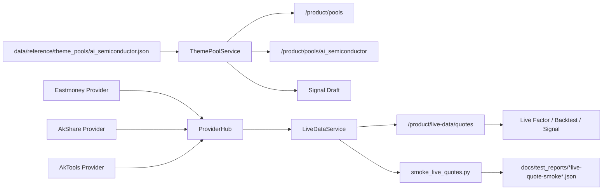

# A-share Live Data Closed-loop Acceptance Fix Architecture

Date: 2026-06-11
Owner role: Architect Agent
Input documents:

- `docs/requirements/2026-06-10-a-share-live-data-closed-loop-requirements.md`
- `docs/design/2026-06-10-a-share-live-data-closed-loop-architecture.md`
- `docs/acceptance/2026-06-11-a-share-live-data-closed-loop-acceptance.md`
- `docs/review/2026-06-11-a-share-live-data-closed-loop-architecture-review-r1.md`
- `docs/review/2026-06-11-a-share-live-data-closed-loop-architecture-review-r2.md`
- `docs/review/2026-06-11-a-share-live-data-closed-loop-architecture-review-r3.md`

## 1. Iteration Goal

The current A-share live-data closed loop is safe, but product acceptance is still
`REJECTED`. This iteration must convert the delivery from "safe fail-closed APIs"
to "usable live-data demo for real monitoring, factor computation, backtesting,
and signal drafting".

This document only plans the next acceptance-fix iteration. It does not reopen
previously approved safety decisions:

- Real orders remain disabled unless explicitly enabled by policy and user action.
- Risk Agent remains a hard veto.
- `LEVEL_3_AUTO` must not be exposed as a normal user-facing configuration option.
- Demo fallback is forbidden for acceptance of live-data product functions.
- When live data is unavailable, signal generation must stay blocked.

## 2. Acceptance Findings to Fix

### P0-1 Theme pool is empty

Observed in PM acceptance:

- `/product/pools` returned `theme_pool.stock_count=0`.
- `/product/pools/ai_semiconductor` returned empty `stocks` and `tags`.
- Four stock-pool tests failed because `data/reference/theme_pools/ai_semiconductor.json`
  does not exist.

Required product outcome:

- Built-in `ai_semiconductor` theme pool exists.
- It contains 100-300 A-share mainboard candidates.
- It has usable tags, including `ai_chip` and `optical_module`.
- It excludes ChiNext, STAR Market, ST, delisting-arrangement stocks, and non-A-share
  symbols.

### P0-2 Live quote smoke cannot prove real realtime quotes

Observed in PM acceptance:

- `/product/live-data/quotes?symbols=600000.SH,000001.SZ` returned `status=failed`.
- Eastmoney disconnected, AkShare retried and failed, AkTools was unavailable.
- Fail-closed behavior was correct, but the product goal requires a real-data path
  that can be demonstrated during acceptance.

Required product outcome:

- A deterministic smoke command can be run during A-share trading hours.
- At least 10 mainboard symbols return usable non-demo realtime quotes.
- Smoke output records provider, fallback chain, latency, `updated_at`, and data health.
- If providers fail, the system still fails closed and generates feedback, but PM
  acceptance remains blocked until a successful real-data smoke is produced.

## 3. Target Architecture

The next iteration is split into two vertical slices:

1. Versioned theme-pool data pack.
2. Realtime quote acceptance harness plus provider hardening.

The theme-pool work is deterministic and must be fully covered by unit tests.
The realtime work has two layers: mocked provider tests for CI and a manual or
scheduled market-hours smoke for product acceptance.



## 4. Module Development Guidance

### 4.1 Theme Pool Data Pack

Primary files:

- `data/reference/theme_pools/ai_semiconductor.json`
- `src/product_app/stock_pool_service.py`
- `tests/test_stock_pool_service.py`
- Optional: `scripts/validate_theme_pool.py`
- Optional: `tests/test_theme_pool_contract.py`

Required JSON shape:

```json
{
  "pool_id": "ai_semiconductor",
  "name": "AI算力/半导体",
  "version": "2026-06-11",
  "updated_at": "2026-06-11T00:00:00+08:00",
  "data_source": "curated_reference",
  "universe": "a_share_mainboard",
  "tags": [
    {"id": "ai_chip", "name": "AI芯片"},
    {"id": "optical_module", "name": "光模块"},
    {"id": "advanced_packaging", "name": "先进封装"}
  ],
  "stocks": [
    {
      "symbol": "600584.SH",
      "name": "长电科技",
      "exchange": "SH",
      "board_type": "main",
      "tags": ["advanced_packaging"],
      "is_st": false,
      "is_delisting": false,
      "evidence": "curated from public semiconductor/AI compute industry classification"
    }
  ]
}
```

Contract rules:

- `stocks` length must be between 100 and 300.
- `symbol` must match `^\d{6}\.(SH|SZ)$`.
- Only mainboard symbols are allowed:
  - Shanghai: `600`, `601`, `603`, `605`.
  - Shenzhen: `000`, `001`, `002`, `003`.
- Exclude ChiNext (`300`, `301`), STAR Market (`688`, `689`), B-shares, ETFs,
  indices, ST names, and delisting-arrangement names.
- `tags` must include `ai_chip` and `optical_module`.
- Every stock must have at least one tag from the top-level tag list.
- `version`, `updated_at`, and `data_source` are mandatory.
- The file is a curated reference data artifact. Developers must not scrape and
  blindly commit unverified names.

Implementation logic:

```python
def validate_theme_pool(payload: dict) -> list[str]:
    errors = []
    stocks = payload.get("stocks", [])
    tags = {tag["id"] for tag in payload.get("tags", [])}

    if not 100 <= len(stocks) <= 300:
        errors.append("stock count must be between 100 and 300")
    if not {"ai_chip", "optical_module"} <= tags:
        errors.append("required tags missing")

    seen = set()
    for item in stocks:
        symbol = item["symbol"]
        if symbol in seen:
            errors.append(f"duplicate symbol: {symbol}")
        seen.add(symbol)
        if not is_a_share_mainboard(symbol):
            errors.append(f"non-mainboard symbol: {symbol}")
        if item.get("is_st") or item.get("is_delisting"):
            errors.append(f"blocked risk symbol: {symbol}")
        if not set(item.get("tags", [])) <= tags:
            errors.append(f"unknown tag on {symbol}")
    return errors
```

`ThemePoolService` may continue to fail gracefully when the file is missing, but
the product acceptance environment must include the data file. If parser changes
are needed, keep them backward-compatible with the current API response shape.

### 4.2 Realtime Quote Provider Hardening

Primary files:

- `src/data_gateway/eastmoney_provider.py`
- `src/data_gateway/realtime_provider.py`
- `src/data_gateway/provider_hub.py`
- `src/product_app/live_data_service.py`
- `tests/test_live_data_service.py`
- Optional: `tests/test_eastmoney_provider.py`

Required behavior:

- Eastmoney remains the first public realtime provider for A-share quotes.
- AkShare and AkTools remain fallback providers.
- ProviderHub must continue to fail closed after all providers fail.
- No provider may return demo data when `allow_demo=False`.
- Provider errors must preserve enough detail for feedback generation.

Eastmoney hardening guidance:

- Use browser-like request headers and a valid referer.
- Keep connect and read timeouts short enough for UI use.
- Keep the existing bulk endpoint, but add a deterministic single-symbol fallback
  when the bulk request disconnects or returns malformed data.
- Normalize single-symbol fallback output through the same mapper used by the bulk
  path so API contracts do not diverge.

Suggested provider flow:

```python
def get_realtime_quotes(symbols: list[str]) -> ProviderResult:
    try:
        all_quotes = fetch_all_a_share_realtime()
        quotes = filter_symbols(all_quotes, symbols)
        if enough_quotes(quotes, symbols):
            return ok(quotes, provider="eastmoney")
    except Exception as exc:
        record_provider_error("eastmoney_bulk", exc)

    fallback_quotes = []
    for symbol in symbols:
        try:
            quote = fetch_single_symbol_quote(symbol)
            fallback_quotes.append(quote)
        except Exception as exc:
            record_provider_error(f"eastmoney_single:{symbol}", exc)

    if fallback_quotes:
        return partial_or_ok(fallback_quotes, provider="eastmoney_single")
    return failed(errors=collected_errors)
```

Mocked tests must cover:

- Eastmoney client sends required headers.
- Bulk success maps at least one quote.
- Bulk disconnect plus single-symbol success returns non-demo quotes.
- Bulk and single-symbol failure returns a failed `ProviderResult` without demo data.
- ProviderHub preserves fallback order and data health.

### 4.3 Market-hours Smoke Script

Primary file:

- `scripts/smoke_live_quotes.py`

Output directory:

- `docs/test_reports/`

Purpose:

The smoke script is the official product evidence for the realtime quote path.
It is intentionally separate from CI because it depends on external public data
providers and market time.

Required command shape:

```powershell
.\.venv\Scripts\python.exe scripts\smoke_live_quotes.py `
  --symbols 600000.SH,000001.SZ,600584.SH,002463.SZ,603986.SH,601138.SH,000021.SZ,600703.SH,603228.SH,002371.SZ `
  --min-success 10 `
  --output docs\test_reports\2026-06-11-a-share-live-quote-smoke.json
```

Required JSON output:

```json
{
  "status": "passed",
  "run_at": "2026-06-11T10:00:00+08:00",
  "trading_session": "continuous_auction",
  "symbols_requested": 10,
  "symbols_succeeded": 10,
  "is_demo": false,
  "provider": "eastmoney",
  "fallback_chain": ["eastmoney"],
  "latency_ms": 850,
  "data_status": "OK",
  "updated_at_min": "2026-06-11T09:59:58+08:00",
  "updated_at_max": "2026-06-11T10:00:01+08:00",
  "feedback_bug_id": null,
  "quotes_sample": [
    {
      "symbol": "600000.SH",
      "price": 10.01,
      "volume": 123456,
      "updated_at": "2026-06-11T10:00:00+08:00",
      "provider": "eastmoney"
    }
  ]
}
```

Exit-code rules:

- `0`: realtime acceptance smoke passed.
- `1`: script error or invalid arguments.
- `2`: providers failed closed; safety is preserved, but product acceptance fails.
- `3`: providers returned data, but fewer than `--min-success` symbols were usable.

The script must refuse to mark acceptance as passed if `is_demo=True`.

Trading-hour rule:

- Preferred smoke window: 09:30-11:30 or 13:00-15:00 Asia/Shanghai on an A-share
  trading day.
- Outside trading hours, the script may record provider behavior, but the PM
  acceptance report must clearly state whether the evidence is after-hours
  snapshot data or live trading-session data.

### 4.4 UI and API Acceptance Surface

Primary files:

- `src/api/product_routes.py`
- `src/ui_report/product_dashboard.py`

Required visible behavior:

- `/product/pools` shows a non-empty `ai_semiconductor` theme pool.
- `/product/pools/ai_semiconductor` returns stocks and tags.
- Live Data page can request realtime quotes for the built-in theme pool.
- Factor Lab can compute live factors from the same non-demo quote path.
- Signal draft remains blocked when realtime quotes fail.

Do not add a separate demo-only happy path. The product must make real data health
understandable to the user.

Recommended UI copy/state behavior:

- Show provider name, data status, and last update time near realtime quote tables.
- Show fail-closed feedback bug id when live data fails.
- Keep `LEVEL_3_AUTO` hidden from generic user configuration.

## 5. Development Pipeline for Agents

All agents must follow `AGENT_DEVELOPMENT_PIPELINE.md`.

### Developer Agent sequence

1. Read this architecture document and the PM acceptance report.
2. Create or update tests before implementation where practical.
3. Implement the theme-pool data pack.
4. Add the theme-pool validator or contract tests.
5. Harden realtime provider behavior with mocked tests.
6. Add the market-hours smoke script.
7. Run required verification commands.
8. Produce a development report in:
   `docs/dev_reports/2026-06-11-a-share-live-data-closed-loop-acceptance-fix-report.md`

The development report must include:

- Files changed.
- Exact test commands and outputs.
- Theme pool stock count and tag list.
- Smoke script command and JSON output path.
- Any remaining provider instability and feedback bug ids.

### Test Engineer Agent sequence

1. Read the requirements, architecture, PM acceptance report, and developer report.
2. Run deterministic unit tests.
3. Run API smoke tests with `TestClient`.
4. Run realtime smoke during market hours if possible.
5. Verify no demo fallback is used for acceptance.
6. Produce a test report in:
   `docs/test_reports/2026-06-11-a-share-live-data-closed-loop-acceptance-fix-verification-report.md`

The test report must include:

- Pass/fail result by acceptance criterion.
- API response excerpts for pools and live quotes.
- Realtime smoke JSON path.
- Whether the smoke was run during trading hours.
- A final recommendation: `PASS`, `PASS_WITH_NOTES`, or `REJECTED`.

## 6. Required Verification Commands

Run at minimum:

```powershell
.\.venv\Scripts\python.exe -m pytest tests\test_stock_pool_service.py tests\test_live_data_mapper.py tests\test_live_data_service.py tests\test_search_evidence.py tests\test_live_signal.py -q --basetemp=runtime\pytest-tmp-acceptance-fix
```

Run ruff on touched source and tests:

```powershell
.\.venv\Scripts\python.exe -m ruff check data scripts src\product_app src\data_gateway src\api src\ui_report tests
```

Run realtime smoke during A-share market hours:

```powershell
.\.venv\Scripts\python.exe scripts\smoke_live_quotes.py --symbols 600000.SH,000001.SZ,600584.SH,002463.SZ,603986.SH,601138.SH,000021.SZ,600703.SH,603228.SH,002371.SZ --min-success 10 --output docs\test_reports\2026-06-11-a-share-live-quote-smoke.json
```

If broad ruff fails because of pre-existing unrelated files, the developer report
must also include a narrowed command against touched files and explain the
pre-existing failures.

## 7. Acceptance Gate

This iteration can return to PM acceptance only when all P0 gates pass:

- `ai_semiconductor` theme pool exists and has 100-300 valid mainboard symbols.
- `ai_chip` and `optical_module` tags both return non-empty filtered stock lists.
- Current stock-pool tests pass.
- `/product/pools` and `/product/pools/ai_semiconductor` return non-empty data.
- Realtime smoke returns at least 10 usable non-demo quotes.
- Smoke output records provider, fallback chain, latency, `updated_at`, and data health.
- Signal draft still blocks when realtime data fails.
- No generic UI path exposes `LEVEL_3_AUTO` as a casual selectable mode.

If the only remaining failure is external provider outage, the system may be
considered safety-correct but must remain product-acceptance `REJECTED` until a
successful real-data smoke is captured.

## 8. Out-of-scope Follow-ups

The following PM notes are valid but should not block the P0 acceptance-fix
iteration unless they are touched directly:

- Expand Factor Lab beyond technical factors.
- Quarantine legacy demo fallback quote tests.
- Clean pre-existing ruff issues in `src/ui_report/dashboard.py`.
- Add scheduled market-hours CI or operator runbook for live smoke.
- Add paid or authenticated quote providers.

