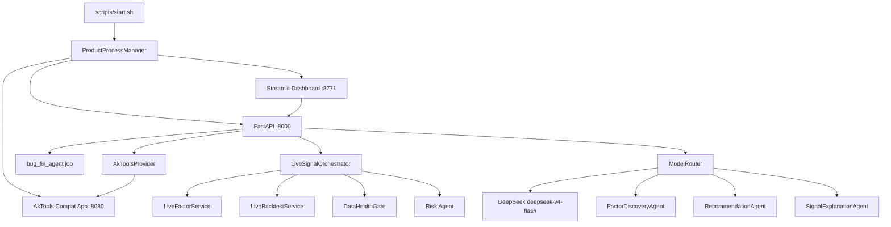

# WSL Product Runtime and AI Agent Architecture

> 角色：Architect Agent  
> 日期：2026-06-11  
> 状态：READY_FOR_DEVELOPMENT  
> 对应需求：`docs/requirements/2026-06-11-wsl-product-runtime-ai-agent-requirements.md`  
> 适用管线：`docs/process/AGENT_DEVELOPMENT_PIPELINE.md`

---

## 1. 架构目标

本设计解决两个层面的交付问题：

1. **产品运行闭环**：WSL 用户可以一键启动、停止、重启 AkTools、FastAPI、Dashboard 和 BugFix Agent，不再手动管理多个服务。
2. **AI Agent 能力闭环**：DeepSeek `deepseek-v4-flash` 通过统一 LLM Router 接入因子挖掘、研究推荐、信号解释，但不直接决定买卖，不绕过 Risk Agent。

本设计不启用真实自动交易，不修改第三方包源码，不允许 BugFix Agent 自动修改受限模块。

---

## 2. 需求映射

| 需求 ID | 架构模块 | 说明 |
|---|---|---|
| F-001 | `src/integrations/aktools_compat_app.py` | 包装 AkTools FastAPI app，修复首页模板签名 |
| F-002/F-003/F-004 | `scripts/start_product.py`、`scripts/stop_product.py` | 统一进程管理，支持 WSL/Linux |
| F-005 | 文档和报告约束 | 新增文档使用 `/` |
| F-006/F-007 | `src/llm/model_router.py`、配置服务 | 统一模型配置，默认 `deepseek-v4-flash` |
| F-008 | `src/agent_orchestrator/factor_discovery_agent.py` | AI 因子假设和证据生成 |
| F-009 | `src/agent_orchestrator/recommendation_agent.py` | AI 研究推荐，不输出交易指令 |
| F-010 | `src/agent_orchestrator/signal_explanation_agent.py` | AI 信号解释，不改变信号结果 |
| F-011 | `src/product_app/bug_fix_workflow.py`、`src/product_app/bug_fix_agent.py` | proposal 路径校验、受限模块阻断 |
| F-012 | `scripts/summarize_feedback_bugs.py` | 汇总现有 feedback Bug |
| F-013 | `src/api/product_routes.py`、`src/ui_report/product_dashboard.py` | 暴露服务状态和模型状态 |

---

## 3. 当前系统约束

相关现有文件：

```text
src/data_gateway/aktools_provider.py
src/product_app/service_manager.py
src/product_app/bug_fix_agent.py
src/product_app/bug_fix_workflow.py
src/product_app/live_signal_orchestrator.py
src/product_app/live_factor_service.py
src/product_app/live_backtest_service.py
src/api/product_routes.py
src/ui_report/product_dashboard.py
scripts/start_product.py
scripts/stop_product.py
scripts/start.sh
scripts/stop.sh
scripts/restart.sh
.env.example
feedback/bugs/
```

关键约束：

1. `AkToolsProvider` 通过 HTTP 访问 `AKTOOLS_BASE_URL/api/public/<endpoint>`。
2. `BugFixAgent` 使用 OpenAI-compatible SDK 访问 DeepSeek。
3. `LiveSignalOrchestrator` 已是当前信号草稿主入口。
4. `Risk Agent` 和数据健康门禁不能被绕过。
5. `.venv` 目录不可作为修复目标。

---

## 4. 总体数据流



---

## 5. 模块设计

### 5.1 AkTools 兼容 App

新增文件：

```text
src/integrations/aktools_compat_app.py
```

职责：

1. 复用 `aktools.main.app` 的既有路由。
2. 移除 AkTools 原有 `/` route。
3. 重新注册兼容新版 Starlette 的 `/` route。
4. 不修改 `.venv`、不 monkey patch 全局 Starlette。

伪代码：

```python
from fastapi import Request
from aktools.main import app, templates, get_latest_version
import akshare
import aktools


def _remove_homepage_route() -> None:
    app.router.routes = [
        route for route in app.router.routes
        if not (
            getattr(route, "path", None) == "/"
            and "GET" in getattr(route, "methods", set())
        )
    ]


_remove_homepage_route()


@app.get("/", tags=["主页"], description="AKTools homepage", summary="AKTools homepage")
async def compatible_homepage(request: Request):
    return templates.TemplateResponse(
        request=request,
        name="homepage.html",
        context={
            "ip_address": request.headers.get("host", ""),
            "ak_current_version": akshare.__version__,
            "at_current_version": aktools.__version__,
            "ak_latest_version": get_latest_version("akshare"),
            "at_latest_version": get_latest_version("aktools"),
        },
    )
```

启动命令：

```bash
./.venv/bin/python -m uvicorn src.integrations.aktools_compat_app:app --host 127.0.0.1 --port 8080
```

测试：

```text
tests/test_aktools_compat_app.py
```

---

### 5.2 产品进程管理

修改：

```text
scripts/start_product.py
scripts/stop_product.py
scripts/start.sh
scripts/stop.sh
scripts/restart.sh
```

新增参数：

```text
--with-aktools
--with-bugfix
--api-port
--aktools-port
--streamlit-port
--force
--dry-run
```

默认端口：

| 服务 | 默认端口 |
|---|---|
| AkTools | 8080 |
| FastAPI | 8000 |
| Streamlit | 8771 |

PID 文件：

```text
runtime/product.pid.json
```

字段：

```json
{
  "aktools_pid": 1001,
  "api_pid": 1002,
  "streamlit_pid": 1003,
  "aktools_port": 8080,
  "api_port": 8000,
  "streamlit_port": 8771,
  "bug_fix_agent_requested": true,
  "started_at": "2026-06-11T10:00:00"
}
```

平台兼容：

```python
def _popen_kwargs() -> dict:
    if os.name == "nt":
        return {"creationflags": subprocess.CREATE_NEW_PROCESS_GROUP}
    return {"start_new_session": True}
```

BugFix Agent 启动：

1. 先启动 API。
2. 等待 `/product/health` 可访问。
3. 如果 `--with-bugfix` 且存在 `DEEPSEEK_API_KEY`，POST：

```text
http://127.0.0.1:<api_port>/product/jobs/bug_fix_agent/start
```

4. 如果缺少 key，只记录 warning，不阻断基础服务。

健康等待伪代码：

```python
def _wait_http_ok(url: str, timeout_seconds: int = 30) -> bool:
    deadline = time.time() + timeout_seconds
    while time.time() < deadline:
        try:
            response = urllib.request.urlopen(url, timeout=2)
            if response.status < 500:
                return True
        except Exception:
            time.sleep(1)
    return False
```

---

### 5.3 统一 LLM Model Router

新增：

```text
src/llm/model_router.py
src/llm/__init__.py
tests/test_model_router.py
```

配置优先级：

1. `LLM_PROVIDER`
2. `LLM_MODEL`
3. `LLM_API_BASE`
4. `LLM_API_KEY_ENV`
5. 兼容旧配置：`DEEPSEEK_API_KEY`、`DEEPSEEK_API_BASE`、`DEEPSEEK_MODEL`

默认值：

```text
LLM_PROVIDER=deepseek
LLM_MODEL=deepseek-v4-flash
LLM_API_BASE=https://api.deepseek.com
LLM_API_KEY_ENV=DEEPSEEK_API_KEY
```

接口：

```python
@dataclass(frozen=True)
class LLMConfig:
    provider: str
    model: str
    api_base: str
    api_key_env: str
    api_key_present: bool


class ModelRouter:
    def get_config(self) -> LLMConfig: ...
    def chat_json(self, *, system_prompt: str, user_prompt: str, schema_name: str) -> dict: ...
```

错误策略：

| 场景 | 行为 |
|---|---|
| 缺少 API key | 返回 `{"status": "unavailable", "reason": "missing_api_key"}` |
| LLM 返回非 JSON | 返回 `{"status": "invalid_response", "raw": "..."}` |
| 网络异常 | 返回 `{"status": "failed", "reason": "..."} ` |

注意：`ModelRouter` 不允许知道交易执行逻辑，不允许生成订单。

---

### 5.4 AI Agent 模块

新增：

```text
src/agent_orchestrator/factor_discovery_agent.py
src/agent_orchestrator/recommendation_agent.py
src/agent_orchestrator/signal_explanation_agent.py
tests/test_ai_research_agents.py
```

#### 5.4.1 FactorDiscoveryAgent

输入：

```python
{
    "symbols": ["600000.SH"],
    "theme_tags": ["bank"],
    "market_snapshot": {...},
    "factor_summary": {...},
    "evidence_sources": [...]
}
```

输出：

```python
{
    "status": "ok",
    "hypotheses": [
        {
            "hypothesis_id": "FD_20260611_001",
            "name": "low_volatility_reversal_candidate",
            "description": "...",
            "theme_tags": ["bank"],
            "evidence": ["..."],
            "source": ["market_data", "theme_pool"],
            "confidence": 0.62,
            "risk_notes": ["..."],
            "llm_model": "deepseek-v4-flash"
        }
    ]
}
```

约束：

1. 不输出可直接用于交易的数值因子。
2. 不输出 `BUY`、`SELL`。
3. `confidence` 只是研究置信度，不是下单置信度。

#### 5.4.2 RecommendationAgent

职责：

1. 将已有股票池、数据健康、因子摘要、回测摘要组合为研究推荐。
2. 输出候选排序和解释。
3. 明示“研究推荐，不是买卖建议”。

输出字段：

```python
{
    "status": "ok",
    "disclaimer": "Research ranking only. Not a trading instruction.",
    "candidates": [
        {
            "symbol": "600000.SH",
            "rank": 1,
            "research_reason": "...",
            "evidence": ["..."],
            "source": ["factor_summary", "backtest_summary"],
            "confidence": 0.58,
            "risk_notes": ["..."]
        }
    ]
}
```

#### 5.4.3 SignalExplanationAgent

输入：

```python
{
    "signal_draft": {...},
    "data_health": {...},
    "factor_summary": {...},
    "backtest_summary": {...},
    "risk_check": {...}
}
```

输出：

```python
{
    "status": "ok",
    "signal_id": "SIG_20260611_001",
    "explanation": "...",
    "evidence": ["..."],
    "risk_notes": ["..."],
    "llm_model": "deepseek-v4-flash",
    "decision_source": "quant_rules_and_risk_gate"
}
```

约束：

1. 不覆盖 `signal_type`。
2. 不创建订单。
3. 被 `DataHealthGate` 阻断时，只解释阻断原因。

---

### 5.5 API 设计

修改：

```text
src/api/product_routes.py
```

新增路由：

```text
GET  /product/llm/status
POST /product/ai/factors/discover
POST /product/ai/recommendations/research
POST /product/ai/signals/{signal_id}/explain
GET  /product/runtime/services
```

#### GET `/product/llm/status`

返回：

```json
{
  "status": "ok",
  "provider": "deepseek",
  "model": "deepseek-v4-flash",
  "api_base": "https://api.deepseek.com",
  "api_key_present": true,
  "trade_decision_enabled": false
}
```

#### POST `/product/ai/factors/discover`

参数：

```text
symbols=600000.SH,000001.SZ
theme_pool=ai_semiconductor
```

#### POST `/product/ai/recommendations/research`

参数：

```text
symbols=600000.SH,000001.SZ
start_date=20250101
end_date=20251231
```

#### POST `/product/ai/signals/{signal_id}/explain`

只解释已有 signal，不生成新 signal。

---

### 5.6 Dashboard 设计

修改：

```text
src/ui_report/product_dashboard.py
src/ui_report/i18n.py
```

最小 UI 增量：

1. System 或 Configuration 页面展示：
   - AkTools status
   - API status
   - BugFix Agent status
   - LLM provider/model
2. Live Data 或 Factor Lab 增加：
   - “AI Factor Discovery” 按钮
   - 展示 hypotheses 表格
3. Signals 页面增加：
   - “Explain Signal” 按钮
   - 展示 signal explanation
4. 所有 AI 输出必须带免责声明：

```text
AI output is research/explanation only. It is not a trading instruction.
```

中文：

```text
AI 输出仅用于研究和解释，不是买卖指令。
```

---

### 5.7 BugFix Agent 提案校验

修改：

```text
src/product_app/bug_fix_agent.py
src/product_app/bug_fix_workflow.py
```

新增 proposal validation：

```python
@dataclass
class ProposalValidationResult:
    is_valid: bool
    invalid_files: list[str]
    blocked_files: list[str]
    messages: list[str]
```

校验规则：

1. `file_path` 必须是相对路径。
2. 路径 resolve 后必须位于项目根目录内。
3. `modify/delete` 的文件必须存在。
4. `add` 只能落在允许目录：

```text
src/
tests/
scripts/
docs/
```

5. 禁止修改：

```text
.venv/
runtime/
logs/
data/raw/
feedback/bugs/fixed/
```

6. 受限模块必须 blocked：

```text
src/risk_engine/
src/execution_engine/
src/trading_log/
src/backtest_engine/report
```

状态流新增：

```text
proposed -> invalid_proposal
proposed -> blocked
```

或在 `process_bug()` 生成 proposal 后立即：

```text
analyzing -> invalid_proposal
```

由开发工程师二选一实现，但 API/UI 必须能展示。

---

### 5.8 Feedback Bug 分类脚本

新增：

```text
scripts/summarize_feedback_bugs.py
```

输出：

```text
docs/test_reports/feedback-bug-summary-YYYYMMDD-HHMMSS.json
docs/test_reports/feedback-bug-summary-YYYYMMDD-HHMMSS.md
```

分类规则：

| 分类 | 匹配 |
|---|---|
| `aktools_compat` | `TemplateResponse`、`Jinja2Templates` |
| `dashboard_timeout` | `read timeout`、`product_dashboard` |
| `provider_capability_gap` | `object has no attribute get_fundamentals` |
| `provider_empty_data` | `empty_data`、`All providers failed` |
| `bugfix_invalid_proposal` | 不存在路径、`OPENAI_API_KEY`、`src/dashboard` |
| `test_dependency_gap` | `No module named playwright` |

---

## 6. 安全设计

### 6.1 LLM 安全边界

LLM 可以：

1. 总结证据。
2. 生成研究假设。
3. 解释已有信号。
4. 解释风险和数据缺失。

LLM 不可以：

1. 直接决定买入或卖出。
2. 直接输出订单。
3. 直接修改仓位。
4. 绕过 Risk Agent。
5. 编造数据源证据。
6. 在数据失败时生成实盘信号。

### 6.2 交易安全

本轮不改变以下不变量：

1. 默认不能真实自动下单。
2. Risk Agent 一票否决。
3. 数据源异常时默认禁止交易。
4. 所有真实订单必须可追溯。
5. 任何策略不得绕过股票池过滤器。

---

## 7. 测试策略

### 7.1 单元测试

新增或修改：

```text
tests/test_aktools_compat_app.py
tests/test_product_process_manager.py
tests/test_model_router.py
tests/test_ai_research_agents.py
tests/test_bug_auto_fix.py
tests/test_product_dashboard_source.py
```

### 7.2 API 测试

覆盖：

```text
/product/llm/status
/product/ai/factors/discover
/product/ai/recommendations/research
/product/ai/signals/{signal_id}/explain
/product/runtime/services
/product/jobs/bug_fix_agent/start
```

### 7.3 WSL Smoke

```bash
bash scripts/start.sh --with-aktools --with-bugfix --streamlit-port 8771
curl http://127.0.0.1:8080/
curl http://127.0.0.1:8080/version
curl http://127.0.0.1:8000/product/health
curl http://127.0.0.1:8000/product/llm/status
curl http://127.0.0.1:8000/product/runtime/services
bash scripts/stop.sh
```

---

## 8. 分阶段实现建议

### Phase A：WSL Runtime P0

1. AkTools compat app。
2. start/stop/restart 脚本支持 AkTools 和 WSL。
3. 默认 Streamlit 端口改为 8771。
4. `.env.example` 模型名更新。
5. Runtime status API。

### Phase B：BugFix Agent P0

1. proposal validation。
2. invalid proposal 状态。
3. DeepSeek key 错误信息修正。
4. feedback bug summary 脚本。

### Phase C：LLM Router P1

1. `ModelRouter`。
2. `/product/llm/status`。
3. 默认 `deepseek-v4-flash`。
4. 兼容后续模型切换。

### Phase D：AI Research Agents P1

1. FactorDiscoveryAgent。
2. RecommendationAgent。
3. SignalExplanationAgent。
4. Dashboard 最小入口。

---

## 9. 开发报告要求

开发工程师完成后输出：

```text
docs/dev_reports/2026-06-11-wsl-product-runtime-ai-agent-dev-report.md
```

必须包含：

1. 每个需求 ID 的实现位置。
2. 实际运行命令和结果。
3. WSL smoke 结果。
4. AI/LLM 安全边界确认。
5. BugFix proposal 校验结果。
6. 未完成项和风险。

---

## 10. 架构门禁结论

本设计满足：

1. 每个 MUST 需求均有实现路径。
2. 不启用真实自动交易。
3. LLM 不直接决定买卖。
4. Risk Agent 和 DataHealthGate 仍位于信号路径。
5. WSL 运行体验有明确验收命令。
6. BugFix Agent 自动修复边界被收紧。

结论：`READY_FOR_DEVELOPMENT`
