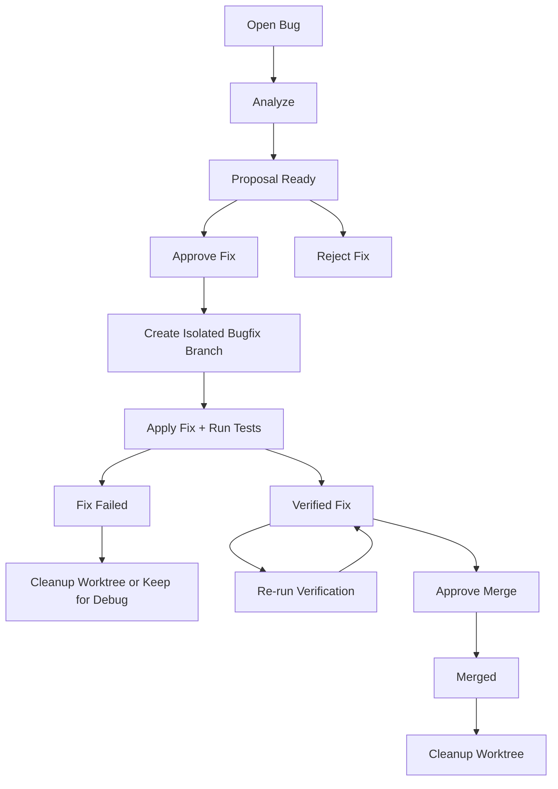

# BugFix Agent Branch Isolation Architecture

Date: 2026-06-12
Owner role: Architect Agent
Target readers: Developer Agent, Test Engineer Agent, Architect Reviewer

## 1. Background

Current BugFixAgent can analyze feedback bugs and generate fix proposals, but its execution path is coupled to the active project working directory.

The current workflow in `src/product_app/bug_fix_workflow.py` checks:

```text
git status --porcelain
```

If the current workspace has uncommitted changes, `_execute_and_verify()` refuses to run with:

```text
工作区存在未提交变更，自动修复已拒绝执行
```

This behavior is safe, but it makes the automation fragile. In normal multi-Agent development, the active branch often contains review docs, test reports, product notes, or other uncommitted handoff artifacts. BugFixAgent should not be blocked by unrelated workspace state, and it must not modify the active development branch.

## 2. Architecture Decision

BugFixAgent must execute fixes in an isolated Git worktree or equivalent isolated checkout.

Target model:

```text
feedback bug
  -> BugWatchdog detects bug
  -> BugFixWorkflow analyzes and proposes fix
  -> human approval
  -> BugFixBranchManager creates isolated bugfix worktree
  -> BugFixAgent applies fix in isolated worktree
  -> tests run in isolated worktree
  -> commit created on bugfix branch
  -> merge request / merge proposal produced
  -> human approval
  -> merge to main or configured base branch
```

The default base branch should be `main`, but it must be configurable because feature work may need to target a release branch or active development branch.

BugFixAgent must not directly modify the user’s current working tree.

## 3. Direct Answer To Current Question

Yes, conceptually the correct flow is:

1. Start from `main`.
2. Create a dedicated local bugfix branch.
3. Apply the fix on that branch in an isolated worktree.
4. Run tests there.
5. Commit the fix there.
6. Return a merge proposal.
7. Merge back to `main` only after human approval and required gates.

However, the agent should not automatically merge to `main` by default. A direct merge to `main` is allowed only when all of these are true:

- the fix is low risk;
- tests pass;
- no restricted module is touched;
- no trading safety invariant is affected;
- human approval is recorded;
- repository policy allows direct local merge.

For normal use, the safer default is:

```text
create bugfix branch -> commit fix -> write report -> wait for human merge approval
```

## 4. Current Implementation Gaps

### 4.1 Current workspace coupling

`BugFixWorkflow._execute_and_verify()` checks the active `_PROJECT_ROOT` for dirty files and blocks all fixes if any unrelated file is modified.

This protects user changes, but it also means BugFixAgent cannot run while:

- an architect review report is uncommitted;
- a tester is writing a test report;
- a developer has local changes;
- generated runtime files are present;
- another Agent is mid-task.

### 4.2 No isolated branch manager

There is currently no component responsible for:

- fetching/updating base branch;
- creating a bugfix branch;
- creating a Git worktree;
- running commands inside that worktree;
- cleaning up worktrees;
- reporting branch/commit metadata.

### 4.3 Commit occurs in active workspace

Current commit logic runs:

```text
git add <file>
git commit -m ...
```

inside `_PROJECT_ROOT`. That makes the active branch carry automated fixes.

### 4.4 No merge policy

The current workflow commits a fix but does not clearly distinguish:

- fix committed;
- fix verified;
- ready for review;
- approved to merge;
- merged.

These states must be separate.

## 5. Required New Components

### 5.1 BugFixBranchManager

Create:

```text
src/product_app/bug_fix_branch_manager.py
```

Responsibilities:

- read base branch config;
- validate repository state;
- create isolated worktree;
- create bugfix branch;
- expose worktree path;
- run git status checks inside worktree;
- commit fix inside worktree;
- optionally merge after approval;
- clean up worktree safely.

Suggested class:

```python
class BugFixBranchManager:
    def __init__(
        self,
        project_root: Path,
        worktree_root: Path | None = None,
        base_branch: str = "main",
    ) -> None:
        ...

    def prepare_worktree(self, bug_id: str) -> BugFixWorktree:
        ...

    def commit_fix(self, worktree: BugFixWorktree, files: list[str], message: str) -> str:
        ...

    def cleanup_worktree(self, worktree: BugFixWorktree, *, keep_on_failure: bool) -> None:
        ...
```

Suggested data model:

```python
@dataclass(frozen=True)
class BugFixWorktree:
    bug_id: str
    base_branch: str
    branch_name: str
    path: Path
    base_sha: str
```

Branch naming:

```text
bugfix/<bug-id>-<YYYYMMDD-HHMMSS>
```

Worktree path:

```text
runtime/bugfix_worktrees/<bug-id>-<timestamp>/
```

The worktree root must be ignored by Git.

### 5.2 BugFixExecutionContext

Create an execution context object passed from workflow to agent:

```python
@dataclass
class BugFixExecutionContext:
    bug_id: str
    project_root: Path
    base_branch: str
    branch_name: str
    worktree_path: Path
```

`BugFixAgent.execute_fix()` should operate against `context.worktree_path`, not global `_PROJECT_ROOT`.

### 5.3 MergeApproval State

Extend bug state fields:

```json
{
  "fix_branch": "bugfix/BUG_20260612_ABC123-20260612-153000",
  "fix_commit": "abc123...",
  "fix_worktree_path": "runtime/bugfix_worktrees/BUG_20260612_ABC123-20260612-153000",
  "base_branch": "main",
  "base_sha": "def456...",
  "merge_status": "pending_approval",
  "merge_approved_by": "",
  "merge_commit": ""
}
```

Recommended state flow:

```text
open
  -> analyzing
  -> proposed
  -> approved
  -> fixing
  -> fix_committed
  -> verified
  -> merge_pending
  -> merged
```

Do not overload `fixed` to mean both “fix exists” and “merged.”

## 6. Configuration

Add environment variables:

```bash
BUGFIX_BASE_BRANCH=main
BUGFIX_WORKTREE_ROOT=runtime/bugfix_worktrees
BUGFIX_AUTO_MERGE=false
BUGFIX_KEEP_WORKTREE_ON_FAILURE=true
BUGFIX_REQUIRE_HUMAN_MERGE_APPROVAL=true
BUGFIX_ALLOWED_BRANCH_PREFIX=bugfix/
```

Defaults:

- `BUGFIX_BASE_BRANCH=main`
- `BUGFIX_AUTO_MERGE=false`
- `BUGFIX_REQUIRE_HUMAN_MERGE_APPROVAL=true`
- `BUGFIX_KEEP_WORKTREE_ON_FAILURE=true`

## 7. Detailed Execution Flow

### 7.1 Analysis and proposal phase

This phase can remain in the main API process:

```text
BugWatchdog -> process_bug() -> analyze() -> propose_fix() -> validate_proposal()
```

No code changes are applied in this phase.

### 7.2 Approval phase

Human approves a proposal:

```text
POST /product/bug-fix/{bug_id}/approve
```

Approval should trigger isolated execution only after:

- proposal is valid;
- bug status is `proposed`;
- restricted module checks pass;
- DeepSeek key is present;
- base branch exists locally or can be fetched.

### 7.3 Isolated execution phase

Pseudo-flow:

```python
def _execute_and_verify(self, bug_id: str) -> dict:
    bug_report = self._read_bug_report(bug_id)
    proposal = bug_report["fix_proposal"]

    worktree = self.branch_manager.prepare_worktree(bug_id)
    try:
        context = BugFixExecutionContext(
            bug_id=bug_id,
            project_root=worktree.path,
            base_branch=worktree.base_branch,
            branch_name=worktree.branch_name,
            worktree_path=worktree.path,
        )
        fix_result = self.bug_fix_agent.execute_fix(bug_report, proposal, context=context)
        if not fix_result["success"]:
            return self._mark_fix_failed(bug_id, fix_result, worktree)

        commit_sha = self.branch_manager.commit_fix(
            worktree,
            files=[c["file_path"] for c in proposal["code_changes"]],
            message=f"fix(auto): {bug_id} - {bug_report.get('title', 'untitled')}",
        )

        self._update_bug_report(
            bug_id,
            fix_result=fix_result,
            fix_branch=worktree.branch_name,
            fix_commit=commit_sha,
            base_branch=worktree.base_branch,
            base_sha=worktree.base_sha,
            merge_status="pending_approval",
        )
        self._transition(bug_id, "verified")
        return {
            "status": "verified",
            "bug_id": bug_id,
            "fix_branch": worktree.branch_name,
            "commit_hash": commit_sha,
            "merge_status": "pending_approval",
        }
    finally:
        if should_cleanup:
            self.branch_manager.cleanup_worktree(worktree, keep_on_failure=True)
```

### 7.4 Merge phase

Add explicit merge API:

```text
POST /product/bug-fix/{bug_id}/merge
```

Merge requirements:

- `merge_status=pending_approval`
- human approval comment present
- branch exists
- branch is descendant of recorded base SHA or can be safely merged
- tests recorded in fix result
- restricted module checks still pass

Default action:

```text
do not merge automatically
```

If `BUGFIX_AUTO_MERGE=true`, still block merge for:

- `src/risk_engine/`
- `src/execution_engine/`
- `src/trading_log/`
- `src/backtest_engine/`
- `docs/policy/`
- any change that affects live trading, orders, risk, data contract, or credentials.

## 8. Git Commands

Suggested safe command sequence:

```bash
git fetch origin main
git worktree add -b bugfix/<bug-id>-<timestamp> runtime/bugfix_worktrees/<bug-id>-<timestamp> origin/main
```

Inside worktree:

```bash
git status --short --branch
./.venv/bin/python -m pytest <related tests> -q --basetemp=runtime/pytest-tmp-bugfix-<bug-id>
./.venv/bin/python -m ruff check <changed python files>
git diff --check
git add <proposal files>
git commit -m "fix(auto): <bug-id> - <title>"
```

Merge, only after explicit approval:

```bash
git switch main
git merge --no-ff bugfix/<bug-id>-<timestamp>
```

If the repository uses remote PRs, prefer pushing branch and creating a PR instead of local merge.

## 9. Safety Constraints

BugFixAgent must never:

- run on dirty active workspace;
- modify the active development branch;
- auto-merge restricted modules;
- auto-fix risk/execution/trading-log/core policy files;
- enable real automatic trading;
- commit secrets or `.env`;
- delete failing tests to pass verification;
- mark a bug fixed when tests failed;
- mark a bug fixed when commit failed;
- hide worktree path, branch name, or commit hash from the bug report.

## 10. API Changes

Existing APIs may remain:

```text
POST /product/bug-fix/{bug_id}/approve
POST /product/bug-fix/{bug_id}/reject
GET  /product/bug-fix/{bug_id}/status
```

Add:

```text
POST /product/bug-fix/{bug_id}/merge
POST /product/bug-fix/{bug_id}/cleanup-worktree
GET  /product/bug-fix/{bug_id}/branch
```

Status response should include:

```json
{
  "bug_id": "BUG_...",
  "status": "verified",
  "base_branch": "main",
  "base_sha": "...",
  "fix_branch": "bugfix/BUG_...",
  "fix_commit": "...",
  "worktree_path": "runtime/bugfix_worktrees/...",
  "merge_status": "pending_approval"
}
```

## 11. Dashboard UX

Dashboard should show:

- current BugFixAgent running state;
- active bugfix branches;
- base branch and base SHA;
- fix branch and commit SHA;
- test result summary;
- merge status;
- buttons:
  - Analyze
  - Approve Fix
  - Reject Fix
  - Merge Fix
  - Cleanup Worktree

The `Merge Fix` button must be disabled unless all merge gates pass.

## 12. Required Tests

### 12.1 Branch manager unit tests

Create:

```text
tests/test_bug_fix_branch_manager.py
```

Must cover:

- creates branch name with `bugfix/` prefix;
- creates worktree under configured root;
- records base branch and base SHA;
- refuses invalid branch names;
- refuses worktree path outside project;
- cleans up worktree only inside configured root;
- commit works only for proposal files;
- merge is disabled by default.

### 12.2 Workflow tests

Extend:

```text
tests/test_bug_auto_fix.py
```

Must cover:

- dirty active workspace does not block isolated fix;
- dirty isolated worktree blocks fix;
- fix executes inside worktree path, not `_PROJECT_ROOT`;
- fix result records `fix_branch`, `fix_commit`, `base_branch`, `base_sha`;
- restricted modules are blocked before branch creation;
- failed tests keep worktree when `BUGFIX_KEEP_WORKTREE_ON_FAILURE=true`;
- no direct merge occurs when `BUGFIX_AUTO_MERGE=false`;
- merge requires explicit API call.

### 12.3 API tests

Must cover:

- approve creates isolated branch and returns branch metadata;
- status exposes branch metadata;
- merge endpoint rejects if tests failed;
- merge endpoint rejects restricted module changes;
- cleanup endpoint only removes known worktree paths.

## 13. Development Tasks

### Task 1: Document and test current failure

Add a regression test proving current dirty active workspace blocks the old flow.

Then add target tests proving dirty active workspace no longer blocks isolated execution.

### Task 2: Implement `BugFixBranchManager`

Create the manager and tests first. Do not modify `BugFixAgent.execute_fix()` yet.

### Task 3: Inject execution context

Change `BugFixAgent.execute_fix()` to accept:

```python
context: BugFixExecutionContext | None = None
```

If context is `None`, keep current behavior for backward compatibility. If context exists, use `context.project_root`.

### Task 4: Refactor workflow execution

Move dirty check from active `_PROJECT_ROOT` to isolated worktree.

### Task 5: Add merge and cleanup APIs

Implement explicit merge and cleanup endpoints. Default merge behavior must be manual.

### Task 6: Update dashboard

Expose branch metadata and merge state.

Implement the user button flow defined in section 17.

### Task 7: Update reports and docs

Update:

- `docs/user_guides/2026-06-11-a-share-live-data-closed-loop-user-manual.md`
- `docs/design/2026-06-11-wsl-product-runtime-ai-agent-architecture.md`
- `docs/policy/SELF_TEST_CHECKLIST.md`

## 14. Verification Commands

Developer Agent must run:

```bash
./.venv/bin/python -m ruff check src/product_app/bug_fix_agent.py src/product_app/bug_fix_workflow.py src/product_app/bug_fix_branch_manager.py tests/test_bug_auto_fix.py tests/test_bug_fix_branch_manager.py
./.venv/bin/python -m pytest tests/test_bug_fix_branch_manager.py tests/test_bug_auto_fix.py -q --basetemp=runtime/pytest-tmp-bugfix-branch
git diff --check
```

If API routes change:

```bash
./.venv/bin/python -m pytest tests/test_product_routes.py tests/test_bug_auto_fix.py -q --basetemp=runtime/pytest-tmp-bugfix-api
```

Test Engineer Agent must follow:

```text
docs/process/TEST_ENGINEER_WORKFLOW.md
```

and run tests from a temporary local test branch.

## 15. Acceptance Gate

Architecture review can pass only if:

- BugFixAgent does not modify the active development branch.
- Dirty active workspace does not block isolated bugfix execution.
- Dirty isolated worktree still blocks execution.
- Every automated fix records base branch, base SHA, fix branch, worktree path, and commit hash.
- Merge to `main` is not automatic by default.
- Manual merge requires explicit approval and passes safety gates.
- Restricted modules remain blocked.
- Dashboard exposes the full user approval flow: Analyze, Approve Fix, Verify,
  Approve Merge, Cleanup Worktree.
- Disabled/enabled button states match backend state and safety gates.
- Tests prove all of the above.

## 16. Operational Guidance

For current manual operation, if BugFixAgent reports:

```text
工作区存在未提交变更，自动修复已拒绝执行
```

the immediate workaround is:

1. commit or stash unrelated local changes; or
2. run BugFixAgent in a clean clone/worktree; or
3. wait for the branch-isolated architecture in this document to be implemented.

Do not force BugFixAgent to run against a dirty active workspace. That would risk overwriting user or Agent work.

## 17. Dashboard User Button Flow

The product must let the user operate BugFixAgent without typing Git commands.

### 17.1 User Goal

As the project owner, I want to:

1. See open feedback bugs.
2. Trigger or inspect AI analysis.
3. Approve a proposed fix.
4. Let the system create an isolated bugfix branch and run verification.
5. Review test evidence and changed files.
6. Approve merge back to `main` or configured base branch.
7. Clean up the temporary worktree/branch when safe.

### 17.2 Required UI States

Dashboard should show each bug as a row or detail panel with:

- bug id
- title
- severity
- component
- current status
- proposal validation status
- base branch
- base SHA
- fix branch
- fix commit
- worktree path
- merge status
- last test command summary
- last test result
- touched files
- blocked reason if blocked

### 17.3 Required Buttons

| Button | Backend action | Enabled when | Disabled when |
|---|---|---|---|
| `Analyze` | `POST /product/bug-fix/{bug_id}/analyze` or existing process action | bug is `open` or previous analysis failed | BugFixAgent not running, missing API key |
| `Approve Fix` | `POST /product/bug-fix/{bug_id}/approve` | bug is `proposed`, proposal validation passes | restricted files, invalid proposal, missing approval text |
| `Reject Fix` | `POST /product/bug-fix/{bug_id}/reject` | bug is `proposed` | already fixing/verified/merged |
| `Re-run Verification` | `POST /product/bug-fix/{bug_id}/verify` | fix branch exists and merge not completed | no fix branch, worktree missing |
| `Approve Merge` | `POST /product/bug-fix/{bug_id}/merge` | status is `verified`, tests pass, merge gates pass | tests failed, restricted files, dirty worktree, no human confirmation |
| `Cleanup Worktree` | `POST /product/bug-fix/{bug_id}/cleanup-worktree` | merge completed or fix failed and user chooses cleanup | branch has unmerged changes unless user confirms |

### 17.4 Button Flow



### 17.5 Merge Confirmation UX

`Approve Merge` must open a confirmation dialog showing:

- target branch, usually `main`
- fix branch
- fix commit
- files changed
- tests passed
- restricted module status
- warning that merge changes repository history

User must type or click explicit confirmation:

```text
Merge this fix into <base_branch>
```

The system must not merge on hover, page refresh, or implicit status polling.

### 17.6 Safety Banners

Show warning banners for:

- `DEEPSEEK_API_KEY` missing
- BugFixAgent job not running
- proposal touches restricted modules
- tests failed
- merge is disabled by policy
- target branch is not `main`
- fix branch has conflicts with target branch
- active worktree has uncommitted changes

### 17.7 Backend API Contract

Add or normalize these endpoints:

```text
GET  /product/bug-fix/bugs
GET  /product/bug-fix/{bug_id}/status
POST /product/bug-fix/{bug_id}/analyze
POST /product/bug-fix/{bug_id}/approve
POST /product/bug-fix/{bug_id}/reject
POST /product/bug-fix/{bug_id}/verify
POST /product/bug-fix/{bug_id}/merge
POST /product/bug-fix/{bug_id}/cleanup-worktree
```

Every mutating endpoint must return:

```json
{
  "status": "ok",
  "bug_id": "BUG_...",
  "bug_status": "verified",
  "base_branch": "main",
  "fix_branch": "bugfix/BUG_...",
  "fix_commit": "abc123",
  "merge_status": "pending_approval",
  "message": "..."
}
```

If blocked:

```json
{
  "status": "blocked",
  "bug_id": "BUG_...",
  "reason": "restricted_module",
  "details": ["src/risk_engine/runtime.py"]
}
```

### 17.8 Frontend Implementation Guidance

Modify:

```text
src/ui_report/product_dashboard.py
```

Add a `Feedback / BugFix` page or section with:

- bug list table
- selected bug detail panel
- analysis/proposal panel
- fix branch panel
- test result panel
- action buttons

Do not make the UI a marketing page. It should be operational and dense enough
for repeated use.

Button styling:

- `Analyze`: normal primary action
- `Approve Fix`: guarded primary action
- `Reject Fix`: secondary/destructive
- `Re-run Verification`: secondary
- `Approve Merge`: destructive/critical confirmation
- `Cleanup Worktree`: secondary

### 17.9 UI Tests

Add tests or source-level assertions covering:

- button labels exist;
- API endpoint strings exist;
- `Approve Merge` requires confirmation;
- restricted proposal disables merge;
- tests failed disables merge;
- missing `DEEPSEEK_API_KEY` shows warning.

If browser tooling is available, add a Streamlit smoke test. If not available,
document the gap in the test report.

### 17.10 Product Acceptance Criteria

PM acceptance can pass only if a user can complete this demo path:

1. Open dashboard.
2. Navigate to Feedback / BugFix section.
3. Select one open bug.
4. View analysis/proposal.
5. Approve fix.
6. See fix branch and test result.
7. Re-run verification.
8. Approve merge.
9. See merge result.
10. Cleanup worktree.

No command-line Git operation should be required for the happy path.
