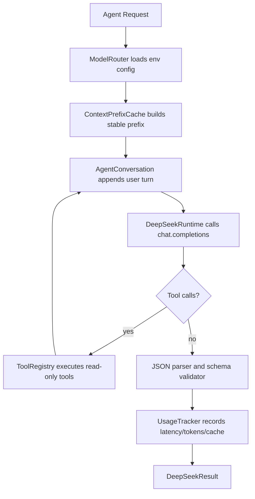

# DeepSeek Agent Runtime Architecture

> 角色：Architect Agent  
> 日期：2026-06-12  
> 状态：READY_FOR_DEVELOPMENT  
> 需求文档：`docs/requirements/2026-06-12-deepseek-agent-runtime-requirements.md`

---

## 1. 架构目标

本设计将项目内 DeepSeek 调用收敛为统一运行框架 `src/llm/`，使 BugFixAgent、因子挖掘 Agent、推荐 Agent、信号解释 Agent 后续都通过同一套能力接入：

- thinking mode
- multi-round chat
- tool calls
- context prefix cache
- JSON Output
- usage and cache metrics
- structured error handling

交易安全边界保持不变：LLM 只能做分析、解释、提案和结构化标签生成，不得直接决定买卖、下单或绕过 Risk Agent。

---

## 2. 现状问题

当前实现中存在两条 LLM 路径：

- `src/llm/model_router.py`：简单配置和 `chat_json()`，实际未启用 DeepSeek JSON Output。
- `src/product_app/bug_fix_agent.py`：直接创建 OpenAI-compatible client，阻塞式调用，手工解析 JSON。

问题：

1. 调用层重复。
2. 缺少 async/timeout/concurrency/cancel。
3. 缺少标准 conversation。
4. 缺少工具调用循环。
5. 缺少 schema 校验和统一错误。
6. 缺少 usage 和 DeepSeek cache hit/miss 观测。

---

## 3. 目标模块

```text
src/llm/
  __init__.py
  model_router.py
  deepseek_runtime.py
  conversation.py
  context_cache.py
  tool_registry.py
  schemas.py
  usage.py
```

| 模块 | 职责 |
|---|---|
| `model_router.py` | 保留 provider/model/env 配置入口，兼容现有 `/product/llm/status` |
| `deepseek_runtime.py` | 统一 DeepSeek/OpenAI-compatible 调用、async/sync wrapper、retry、timeout、JSON Output、thinking、tool loop |
| `conversation.py` | 多轮消息模型、assistant/tool 消息追加、脱敏持久化 |
| `context_cache.py` | 本地稳定 prefix 生成与 fingerprint 管理，提高 DeepSeek 服务端 KV cache 命中概率 |
| `tool_registry.py` | 只读工具注册、schema 暴露、工具执行和安全校验 |
| `schemas.py` | Pydantic schema：请求、响应、错误、BugFix analysis/proposal |
| `usage.py` | token、cache hit/miss、latency、tool round 统计 |

---

## 4. 核心数据结构

### 4.1 LLMTaskProfile

```python
@dataclass(frozen=True)
class LLMTaskProfile:
    name: str
    thinking_enabled: bool
    reasoning_effort: Literal["high", "max"] = "high"
    json_output: bool = True
    timeout_seconds: int = 45
    max_retries: int = 3
    max_tool_rounds: int = 4
    allow_tools: bool = False
```

默认 profile：

| Profile | thinking | tools | JSON | 用途 |
|---|---:|---:|---:|---|
| `bugfix_analysis` | enabled | yes | yes | Bug 根因分析 |
| `bugfix_proposal` | enabled | yes | yes | 修复提案 |
| `factor_hypothesis` | enabled | read-only | yes | 因子假设 |
| `recommendation_research` | enabled | read-only | yes | 研究推荐 |
| `signal_explanation` | disabled | no | yes | 信号解释 |

### 4.2 DeepSeekRequest

```python
class DeepSeekRequest(BaseModel):
    profile: str
    schema_name: str
    system_prompt: str
    user_prompt: str
    conversation_id: str | None = None
    tools: list[str] = []
    json_schema: dict[str, Any] | None = None
    metadata: dict[str, Any] = {}
```

### 4.3 DeepSeekResult

```python
class DeepSeekResult(BaseModel):
    status: Literal["ok", "unavailable", "timeout", "invalid_response", "tool_error", "api_error"]
    data: dict[str, Any] | None = None
    error: dict[str, Any] | None = None
    provider: str
    model: str
    conversation_id: str | None = None
    usage: dict[str, Any] = {}
    tool_calls: list[dict[str, Any]] = []
```

约束：

- `status != "ok"` 时不得被业务层解释为成功。
- `data` 必须通过 schema 校验后返回。
- 原始 `reasoning_content` 不进入 `data`、不进入默认日志。

---

## 5. 调用流程



---

## 6. DeepSeek API 参数映射

### 6.1 Thinking Mode

OpenAI-compatible 调用：

```python
extra_body = {
    "thinking": {"type": "enabled" if profile.thinking_enabled else "disabled"}
}
```

当启用 thinking：

```python
kwargs["reasoning_effort"] = profile.reasoning_effort
```

处理原则：

- 可从 response message 读取 `reasoning_content` 并放入 internal conversation。
- 默认不持久化原始 reasoning。
- 若必须持久化用于多轮延续，只保存在 `runtime/llm_conversations/`，且报告/UI 不展示。

### 6.2 JSON Output

请求必须包含：

```python
response_format = {"type": "json_object"}
```

prompt 构造必须包含：

- 明确 `json` 字样。
- schema 示例。
- `additionalProperties` 期望。

空 content、非法 JSON、schema 校验失败：

```python
return DeepSeekResult(
    status="invalid_response",
    error={"reason": "empty_or_invalid_json", "raw_excerpt": safe_excerpt},
)
```

### 6.3 Tool Calls

请求包含：

```python
tools = registry.to_openai_tools(tool_names)
```

工具循环：

1. 模型返回 assistant message。
2. 若存在 `tool_calls`，追加 assistant message。
3. 对每个 tool call：
   - 校验工具是否注册且只读。
   - 校验 JSON arguments。
   - 执行工具。
   - 结果截断和脱敏。
   - 追加 `role=tool` 消息。
4. 继续调用模型，直到无工具调用或达到 `max_tool_rounds`。
5. 达到上限仍有工具调用则返回 `tool_error`。

### 6.4 Context Cache

DeepSeek 服务端 KV cache 默认启用，本项目只优化输入稳定性：

```text
stable prefix =
  SYSTEM_INVARIANTS
  AGENT_DEVELOPMENT_PIPELINE summary
  task profile instructions
  JSON schema instructions
  safety constraints
```

`ContextPrefixCache` 写入：

```json
{
  "prefix_id": "bugfix_analysis:v1:sha256...",
  "profile": "bugfix_analysis",
  "fingerprint": "sha256...",
  "created_at": "2026-06-12T00:00:00+08:00",
  "source_files": [
    "SYSTEM_INVARIANTS.md",
    "docs/process/AGENT_DEVELOPMENT_PIPELINE.md"
  ],
  "prefix": "..."
}
```

usage 记录：

```python
usage = {
    "prompt_tokens": ...,
    "completion_tokens": ...,
    "prompt_cache_hit_tokens": ...,
    "prompt_cache_miss_tokens": ...,
}
```

若 SDK 没有字段，则填 `None`。

---

## 7. Tool Registry 设计

### 7.1 默认允许工具

| 工具名 | 类型 | 用途 | 限制 |
|---|---|---|---|
| `read_project_file` | read-only | 读取指定项目文件片段 | 必须在项目根目录内；禁止 `.env`、密钥、runtime secret |
| `search_project_text` | read-only | 用 `rg` 搜索关键词 | 限制目录、最大结果数 |
| `list_feedback_bugs` | read-only | 列出 feedback Bug | 只读 `feedback/bugs` |
| `read_feedback_bug` | read-only | 读取单个 Bug | 脱敏 traceback |
| `read_test_report` | read-only | 读取测试报告 | 限制 `docs/test_reports` |
| `read_dev_report` | read-only | 读取开发报告 | 限制 `docs/dev_reports` |

### 7.2 默认禁止工具

- shell 执行。
- 任意文件写入。
- Git add/commit/merge/push。
- 真实交易、订单、broker、risk override。
- 网络搜索。

后续如需写工具，必须单独走架构设计和审批，不属于本轮。

---

## 8. BugFixAgent 迁移设计

### 8.1 当前 public API 保持不变

保留：

```python
BugFixAgent.analyze(bug_report: dict) -> dict
BugFixAgent.propose_fix(bug_report: dict, analysis: dict) -> dict
BugFixAgent.execute_fix(bug_report: dict, proposal: dict) -> dict
```

内部替换：

```python
runtime = DeepSeekRuntime()
result = runtime.chat_json(
    DeepSeekRequest(
        profile="bugfix_analysis",
        schema_name="bugfix_analysis",
        system_prompt=...,
        user_prompt=...,
        tools=[
            "read_feedback_bug",
            "search_project_text",
            "read_project_file",
            "read_test_report",
        ],
    )
)
```

### 8.2 Analysis Schema

```json
{
  "status": "ok",
  "root_cause": "string",
  "affected_files": ["string"],
  "fix_steps": ["string"],
  "risk_level": "low|medium|high|critical",
  "estimated_impact": "string",
  "needs_human_review": true,
  "evidence": [
    {"source": "string", "summary": "string"}
  ]
}
```

### 8.3 Proposal Schema

```json
{
  "status": "ok",
  "fix_description": "string",
  "code_changes": [
    {
      "file_path": "string",
      "change_type": "add|modify|delete",
      "diff": "string",
      "reason": "string"
    }
  ],
  "risk_level": "low|medium|high|critical",
  "estimated_impact": "string",
  "test_suggestions": ["string"],
  "requires_approval": true
}
```

安全校验仍在 workflow 层执行：

- 文件路径必须存在或 change_type 为 add。
- 受限模块阻断。
- 提案必须人工 approve 才能 execute。
- 测试失败回滚。

---

## 9. 非阻塞执行模型

Runtime 提供 async-first：

```python
class DeepSeekRuntime:
    async def chat_json_async(self, request: DeepSeekRequest) -> DeepSeekResult:
        ...

    def chat_json(self, request: DeepSeekRequest) -> DeepSeekResult:
        return run_sync_safely(self.chat_json_async(request))
```

实现要求：

- 使用 `asyncio.Semaphore` 限制并发。
- 每次调用使用 `asyncio.wait_for` 或 SDK timeout。
- retry 只重试 transient error。
- cancellation 返回 `status="timeout"` 或 `status="api_error"`，不得卡住 BugFixWorkflow。

BugFixWorkflow 可先继续用同步 wrapper，后续再迁移后台 job 为 async worker。

---

## 10. 错误模型

| 场景 | status | 行为 |
|---|---|---|
| 缺 API key | `unavailable` | Bug 保持 open 或回退 open |
| 缺 openai SDK | `unavailable` | UI 显示依赖缺失 |
| API 超时 | `timeout` | 不生成提案 |
| 空 content | `invalid_response` | 不进入 approve |
| 非法 JSON | `invalid_response` | 写入 invalid response 摘要 |
| schema 失败 | `invalid_response` | 不执行 |
| tool 不存在 | `tool_error` | 停止本轮 |
| 工具越权 | `tool_error` | 安全阻断 |

---

## 11. 测试策略

必须新增 fake client，不访问真实 DeepSeek：

```text
tests/test_deepseek_runtime.py
tests/test_deepseek_tools.py
tests/test_deepseek_context_cache.py
tests/test_bugfix_agent_deepseek_runtime.py
```

覆盖：

- missing key。
- missing SDK。
- JSON Output 参数。
- thinking 参数。
- multi-round append。
- tool call loop。
- max tool rounds。
- context prefix fingerprint。
- usage cache hit/miss 提取。
- BugFixAgent analysis/proposal schema。
- 禁止写工具。
- 无新增裸 `chat.completions.create`。

---

## 12. 开发顺序

1. 先写 runtime schema 和 fake client 测试。
2. 实现 `DeepSeekRuntime` 最小 JSON Output。
3. 增加 thinking 参数和 usage 提取。
4. 增加 conversation。
5. 增加 context prefix cache。
6. 增加 tool registry 和 tool loop。
7. 迁移 BugFixAgent。
8. 增加状态接口和文档。
9. 运行聚焦测试、ruff、全量相关回归。

---

## 13. 架构 Review 门禁

Review 只有在以下条件满足时通过：

- `BugFixAgent` 不再直接 import/use OpenAI client。
- `src/llm/model_router.py` 不再是唯一 LLM 抽象，runtime 已接管实际调用。
- `rg "chat.completions.create" src` 只允许出现在 `src/llm/deepseek_runtime.py`。
- 所有 JSON 输出经过 schema 校验。
- 所有 tool calls 只读且有测试。
- 缺 key、timeout、空 content 不会卡死 workflow。
- 没有任何真实自动交易能力被启用。
