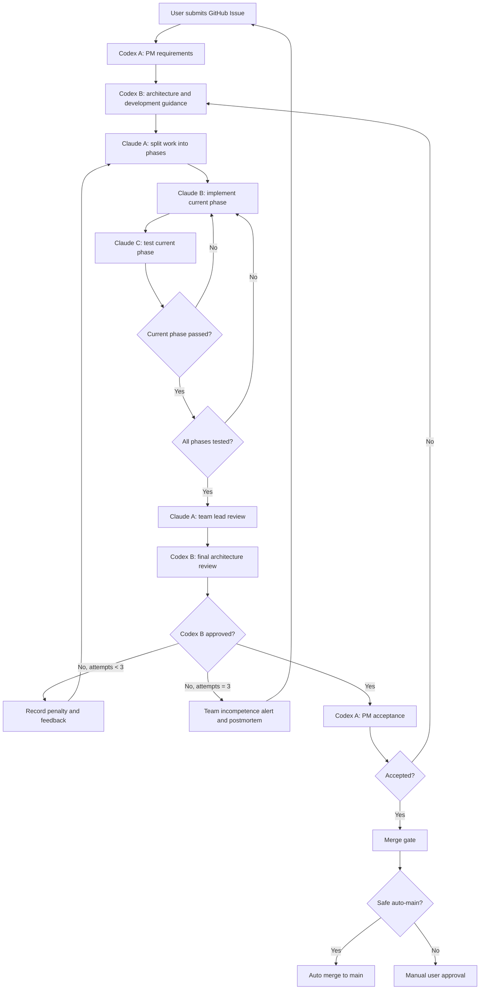

# Agent Team Pipeline V2 Architecture

## Overview

Team Pipeline V2 upgrades the Issue-driven Agent pipeline from a linear
Developer/Tester/Codex Review flow into a cost-aware team workflow.

Codex is used for high-value judgment:

- Codex A: Product Manager and PM Acceptance.
- Codex B: Architect and final Architecture Reviewer.

Claude Code handles high-frequency implementation loops:

- Claude Code A: team lead, phase planning, internal review, and postmortem.
- Claude Code B: phase development.
- Claude Code C: phase testing.

## Corrected Workflow



## State Model

`src/product_app/agent_pipeline_automation.py` owns deterministic state. It
does not call Codex, Claude, or DeepSeek directly.

The V2 state includes:

```yaml
team_pipeline:
  mode: claude_first_review
  default_team_id: claude-team-a
  max_parallel_teams: 3
  max_codex_review_attempts: 3
  current_phase: 1
  all_phases_tested: false
  codex_review_attempts: 0
agent_roles:
  codex_a: [pm, acceptance]
  codex_b: [architecture, codex_review]
  claude_a: [team_plan, claude_lead_review, team_performance]
  claude_b: [phase_dev]
  claude_c: [phase_test]
```

Claude Code C must set `team_pipeline.all_phases_tested=true` only after every
planned phase has a passing phase test report.

## Stage Order

| Stage | Owner | Required evidence | Next stage |
|---|---|---|---|
| `pm` | Codex A | `docs/requirements/*requirements.md` | `architecture` |
| `architecture` | Codex B | `docs/design/*architecture.md` | `team_plan` |
| `team_plan` | Claude A | `docs/dev_plans/*team-plan.md` | `phase_dev` |
| `phase_dev` | Claude B | `docs/dev_reports/*phase-*dev-report.md` | `phase_test` |
| `phase_test` | Claude C | `docs/test_reports/*phase-*test-report.md` | `phase_dev` or `claude_lead_review` |
| `claude_lead_review` | Claude A | `docs/review/*claude-lead-review.md` | `codex_review` |
| `codex_review` | Codex B | `docs/review/*codex-review*.md` | `acceptance`, `team_plan`, or `postmortem` |
| `acceptance` | Codex A | `docs/acceptance/*acceptance.md` | `merge-ready` |

## GitHub Label Mapping

| Label | Runner stage |
|---|---|
| `stage:pm-pending` | bootstrap Codex A |
| `stage:arch-pending` | bootstrap Codex B |
| `stage:team-plan-pending` | `claude_lead_plan` |
| `stage:team-dev-pending` | `claude_developer` |
| `stage:team-test-pending` | `claude_tester` |
| `stage:claude-lead-review-pending` | `claude_lead_review` |
| `stage:codex-review-pending` | `codex_reviewer` |
| `stage:pm-acceptance-pending` | `codex_acceptance` |
| `stage:postmortem-pending` | `postmortem` |
| `stage:merge-ready` | merge gate |

## GitHub Command Variables

Preferred V2 command variables:

| Variable or secret | Role |
|---|---|
| `CODEX_A_PM_AGENT_COMMAND` | Codex A requirements generation |
| `CODEX_B_ARCHITECT_AGENT_COMMAND` | Codex B architecture generation |
| `CLAUDE_LEAD_AGENT_COMMAND` | Claude A phase plan, lead review, and postmortem |
| `CLAUDE_DEVELOPER_AGENT_COMMAND` | Claude B phase development |
| `CLAUDE_TESTER_AGENT_COMMAND` | Claude C phase testing |
| `BUGFIX_AGENT_COMMAND` | isolated bugfix loop |
| `CODEX_B_REVIEW_AGENT_COMMAND` | Codex B final architecture review |
| `CODEX_A_ACCEPTANCE_AGENT_COMMAND` | Codex A PM acceptance |

The workflow keeps legacy fallbacks for `PM_ARCHITECT_AGENT_COMMAND`,
`DEVELOPER_AGENT_COMMAND`, `TEST_AGENT_COMMAND`, `REVIEW_AGENT_COMMAND`, and
`ACCEPTANCE_AGENT_COMMAND` during migration.

## Local Runtime Boundary

GitHub-hosted runners cannot directly control the user's local Windows Codex or
WSL VS Code Claude Code Agent. Full local automation therefore needs one of:

1. self-hosted GitHub runner installed on the user's Windows/WSL machine; or
2. workflow dry-run handoff generation plus local commands that read
   `.agent/handoff/*.md`; or
3. API-backed remote commands configured in repository secrets.

The recommended low-cost setup is a self-hosted runner with:

- Windows Codex command for Codex A/B stages.
- WSL command wrapper for Claude Code A/B/C stages.
- GitHub labels as the single source of stage transitions.

## Penalty and Postmortem Rules

Codex B `CHANGES_REQUESTED` must:

1. increment `team_pipeline.codex_review_attempts`;
2. record failure category and severity under `.agent/team_scoreboard.json`;
3. return feedback to Claude Code A through a review report;
4. route back to `stage:team-plan-pending` or `stage:team-dev-pending`;
5. trigger `stage:postmortem-pending` when attempts reach
   `max_codex_review_attempts`.

The postmortem must explain:

- root cause;
- missed stage gate;
- why Claude A internal review failed to catch the issue;
- required process improvements;
- whether the feature can resume.

## Merge Safety

The existing auto-merge gate remains unchanged in principle. Only docs, tests,
GitHub Issue templates, and `.agent` state are eligible for automatic `main`
merge. Workflow, scripts, API, UI, data providers, trading, risk, execution, and
unknown business code require manual approval.
