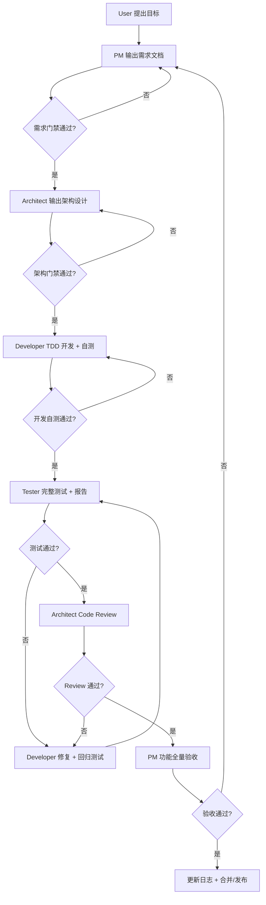

# Agent Development Pipeline

> 本文档是开发团队 Agent 的协作硬约束。产品约束、交易安全约束仍以 `docs/design/AGENTS.md`、`docs/policy/RISK_POLICY.md`、`docs/policy/EXECUTION_POLICY.md`、`docs/policy/SELF_TEST_CHECKLIST.md` 为准；本文档负责规定“谁在什么时候产出什么、谁验收、什么条件才能进入下一环”。

---

## 1. 目标

随着项目进入多 Agent、多工具、多阶段协作，任何新阶段或新功能必须从“口头需求”变成可追踪的工程流水线。流水线必须保证：

1. 用户需求不会被开发 Agent 自行改写。
2. 产品需求、架构设计、代码实现、测试报告、修复记录、Review 结论、产品验收之间可以追溯。
3. 交易安全、风控优先、人工确认、数据契约等系统不变量不会因为多人协作被绕过。
4. 每个 Agent 只在自己的职责边界内工作，跨职责变更必须回到上游文档重新确认。
5. 任一阶段失败时，有明确的退回路径和修复责任人。

---

## 2. 适用范围

本文档适用于：

- 新 Phase 开发。
- 新产品功能或新用户流程。
- 交易、风控、数据、回测、执行、前端、API、Bug 自动处理等核心模块变更。
- 影响用户体验、配置、运行脚本、部署方式、数据源、真实交易安全边界的变更。

以下变更可走轻量流程，但仍必须满足自测清单：

- 纯文档错别字修复。
- 注释、日志文本、README 小修。
- 不改变行为的格式化。

轻量流程最少需要：任务说明、自测结果、提交说明。

---

## 3. 角色与职责

| 角色 | 推荐执行者 | 核心职责 | 不得越界 |
|---|---|---|---|
| User / Owner | 用户本人 | 提出目标、约束、优先级、最终取舍 | 不需要写实现方案 |
| Product Manager Agent | ChatGPT | 理解用户需求，拆解功能点、用户流程和验收标准 | 不得指定未经架构确认的代码实现 |
| Architect Agent | ChatGPT | 输出架构设计、模块边界、接口契约、技术选型、伪代码、风险门禁 | 不得绕过需求文档直接安排开发 |
| Developer Agent | Trae / Claude Code / 其他开发 Agent | 按架构设计实现代码，先写测试，自测并输出开发报告 | 不得修改需求目标或绕过风控/测试 |
| Test Engineer Agent | Trae / Claude Code / 其他测试 Agent | 基于需求和架构做完整测试，输出测试报告和 Bug 清单 | 不得只测 happy path，不得口头通过 |
| BugFix Developer Agent | Trae / Claude Code / BugFixAgent | 根据测试报告修复缺陷，补充回归测试 | 不得无审批修改受限模块 |
| Architect Reviewer | ChatGPT | 完整代码 Review，确认架构一致性和系统安全边界 | 不得只看测试通过就放行 |
| PM Acceptance Agent | ChatGPT | 对照需求文档做功能性全量验收 | 不得用实现细节替代用户视角验收 |

---

## 4. 标准交付物目录

所有新阶段或完整功能必须使用以下目录。目录不存在时由负责 Agent 创建。

自本轮流程整理起，canonical 布局改为 `docs/features/<feature-id>/` 聚合目录。旧的 `docs/requirements/`、`docs/design/`、`docs/dev_reports/`、`docs/test_reports/`、`docs/review/`、`docs/acceptance/` 只保留给历史文档与兼容读取，新功能默认不要再按角色散落写入。

| 目录 | 文件命名 | 负责人 | 内容 |
|---|---|---|---|
| `docs/features/<feature-id>/` | `requirements.md` | Product Manager Agent | 需求、功能点、验收标准 |
| `docs/features/<feature-id>/` | `architecture.md` | Architect Agent | 架构设计、模块边界、接口、伪代码 |
| `docs/features/<feature-id>/` | `team-plan.md` | OpenCode Lead | 多阶段计划、阶段边界、交付顺序 |
| `docs/features/<feature-id>/` | `phase-<n>-dev-report.md` | Developer Agent | 实现说明、自测结果、风险说明 |
| `docs/features/<feature-id>/` | `phase-<n>-test-report.md` | Test Engineer Agent | 测试范围、用例、结果、Bug 清单 |
| `docs/features/<feature-id>/` | `opencode-lead-review.md` / `codex-review-r1.md` | Lead / Architect Reviewer | 阶段总审查与最终代码 Review 结论 |
| `docs/features/<feature-id>/` | `acceptance.md` | PM Acceptance Agent | 产品验收结果、未满足需求 |
| `feedback/bugs/open/` | `BUG_*.md` + `BUG_*.json` | Test / Runtime / Feedback Service | 可修复缺陷 |
| `docs/log/` | 更新现有日志 | 阶段负责人 | 阶段完成、测试结果、版本历史 |

---

## 5. 阶段门禁总览



任何一个门禁未通过，不允许进入下一阶段。

---

## 6. 阶段 0：用户需求输入

### 输入

用户以自然语言提出目标，例如：

- “Phase 6 需要小资金实盘验证。”
- “Dashboard 要支持实时盯盘和人工确认。”
- “自动 feedback 遇到报错后生成 Bug 清单。”

### 输出

用户不需要写正式文档，但必须明确：

1. 业务目标。
2. 必须实现的能力。
3. 明确禁止或担心的风险。
4. 是否要求提交、推送、开 PR 或直接合并。

### 进入下一阶段条件

PM Agent 能用自己的话复述目标，并识别主要功能域和风险域。

---

## 7. 阶段 1：PM 需求文档

### 负责人

Product Manager Agent。

### 必须产出

`docs/features/<feature-id>/requirements.md`

### 文档必须包含

1. 背景和用户问题。
2. 目标与非目标。
3. 用户角色和使用流程。
4. 功能点列表。
5. 每个功能点的预期行为。
6. 每个功能点的验收标准。
7. 配置项需求。
8. 数据需求。
9. UI/交互需求。
10. 安全与风控约束。
11. Demo / paper / live 边界。
12. 可观测性和自动 feedback 需求。
13. 测试范围建议。

### 功能点表模板

| ID | 功能点 | 用户故事 | 预期行为 | 验收标准 | 优先级 |
|---|---|---|---|---|---|
| F-001 | 示例功能 | 作为用户，我希望... | 系统应... | 给定...当...则... | MUST |

### PM 门禁

需求文档满足以下条件才可交给架构师：

- 每个 MUST 功能都有可测试验收标准。
- 非目标明确，避免开发 Agent 自行扩大范围。
- 交易安全边界明确：默认不真实自动下单。
- 若涉及数据源，必须说明数据来源、延迟容忍、fallback 行为。
- 若涉及 UI，必须说明用户完成任务的路径。

---

## 8. 阶段 2：架构设计文档

### 负责人

Architect Agent。

### 必须产出

`docs/features/<feature-id>/architecture.md`

### 文档必须包含

1. 需求映射表：每个功能点对应哪些模块。
2. 当前系统约束和相关已有文件。
3. 模块边界和职责。
4. 数据流和状态流。
5. API / class / function 接口设计。
6. 数据模型和字段定义。
7. 技术选型及理由。
8. 简单伪代码。
9. 错误处理和 fallback 策略。
10. 安全、风控、人工确认、密钥管理影响评估。
11. 测试策略。
12. 分步实现建议。

### 架构门禁

架构设计满足以下条件才可交给开发工程师：

- 每个 PM MUST 功能均有实现路径。
- 不新增绕过 Risk Agent、股票池过滤、人工确认的路径。
- 不把 LLM 作为直接买卖决策源。
- 数据契约字段、单位、时区、价格复权边界明确。
- 对受限模块的修改有明确测试和 Review 要求。
- 给出开发 Agent 能照着实现的模块清单和伪代码。

---

## 9. 阶段 3：开发实现与自测

### 负责人

Developer Agent。

### 必须输入

1. PM 需求文档。
2. 架构设计文档。
3. `docs/policy/SELF_TEST_CHECKLIST.md`。
4. 相关 Policy / Design 文档。

### 必须产出

1. 代码和测试。
2. `docs/features/<feature-id>/phase-<n>-dev-report.md`。

### 开发顺序

1. 读取需求和架构设计。
2. 标出要修改的文件和新增测试。
3. 先写失败测试。
4. 运行测试确认失败原因正确。
5. 实现最小代码。
6. 运行相关测试。
7. 扩展边界测试。
8. 运行自测清单要求的命令。
9. 更新相关文档。
10. 输出开发报告。

### 开发报告必须包含

| 项目 | 内容 |
|---|---|
| 需求文档 | 链接或路径 |
| 架构文档 | 链接或路径 |
| 实现范围 | 修改/新增文件列表 |
| 功能映射 | F-xxx 对应代码文件 |
| 自测命令 | 实际运行命令 |
| 自测结果 | pass/fail、失败原因 |
| 风险说明 | 剩余风险、未覆盖范围 |
| 禁止项确认 | 未启用真实自动下单、未提交密钥、未绕过风控 |

### 开发门禁

满足以下条件才可交给测试工程师：

- 相关测试全部通过。
- `ruff` 或项目约定静态检查通过。
- 自测清单已执行，并在开发报告中记录。
- 文档已同步更新。
- 没有未解释的 skipped、xfail、mock 外部服务依赖。
- 工作区无无关修改。

---

## 10. 阶段 4：测试工程师完整测试

### 负责人

Test Engineer Agent。

### 必须输入

1. PM 需求文档。
2. 架构设计文档。
3. 开发报告。
4. 本次 diff。

### 必须产出

`docs/features/<feature-id>/phase-<n>-test-report.md`

### 测试报告必须包含

1. 测试环境。
2. 测试范围和不测范围。
3. 需求覆盖矩阵。
4. 自动化测试结果。
5. API / UI / 浏览器 / CLI / 数据源测试结果。
6. 安全和风控回归结果。
7. 缺陷列表。
8. 是否建议进入修复、Review 或验收。

### 缺陷处理规则

- MUST / SHOULD 缺陷必须写入测试报告。
- 运行时可复现缺陷必须同步生成 `feedback/bugs/open/BUG_*.md` 和 `.json`。
- 缺陷必须包含复现步骤、期望结果、实际结果、日志或截图路径。

### 测试门禁

测试通过后才可交给架构 Review：

- 所有 MUST 功能通过。
- 无 S0/S1/S2 阻断缺陷。
- 核心交易安全回归通过。
- 前端改动有浏览器渲染验证。
- API 改动有 HTTP 级验证。
- 数据源改动有 mock 测试和异常路径测试。

---

## 11. 阶段 5：缺陷修复循环

### 负责人

BugFix Developer Agent 或原 Developer Agent。

### 修复输入

1. 测试报告。
2. Bug 清单。
3. 原需求和架构文档。

### 修复规则

1. 每个 Bug 必须能追溯到测试报告或 feedback 文件。
2. 修复前先补回归测试。
3. 修复后运行相关测试和自测清单触碰范围命令。
4. 修复不得扩大需求范围。
5. 若发现架构设计错误，必须退回 Architect Agent 更新设计文档。
6. 若发现需求本身不合理，必须退回 PM Agent 更新需求文档。

### 修复完成输出

更新开发报告或新增：

`docs/features/<feature-id>/phase-<n>-dev-report.md` 或 `docs/features/<feature-id>/fix-report.md`

---

## 12. 阶段 6：架构师代码 Review

### 负责人

Architect Reviewer。

### 必须输入

1. 需求文档。
2. 架构文档。
3. 开发报告。
4. 测试报告。
5. 当前 diff。

### Review 重点

1. 是否偏离需求目标。
2. 是否符合架构设计。
3. 模块边界是否清晰。
4. 是否引入隐式耦合。
5. 是否绕过数据契约、风险策略、执行策略。
6. 是否引入真实自动交易风险。
7. 是否有未测试核心路径。
8. 是否需要拆分过大的文件或函数。
9. 是否有安全、密钥、账户、日志泄露风险。
10. 是否满足后续 Phase 可扩展性。

### Review 输出

`docs/features/<feature-id>/codex-review-r1.md`

结论必须为以下之一：

- `APPROVED`: 可进入 PM 验收。
- `APPROVED_WITH_NOTES`: 可进入 PM 验收，但有非阻断改进项。
- `CHANGES_REQUESTED`: 必须退回开发修复。
- `BLOCKED`: 需求或架构本身需重写。

---

## 13. 阶段 7：PM 功能全量验收

### 负责人

PM Acceptance Agent。

### 必须输入

1. 需求文档。
2. 测试报告。
3. 架构 Review 报告。
4. 可运行系统或 Demo。

### 验收方式

PM 必须从用户视角逐项验收，不得只看测试通过：

1. 按用户流程走完整路径。
2. 对照每个功能点验收标准。
3. 验证错误提示是否可理解。
4. 验证配置是否可见、可改、可恢复。
5. 验证 Demo / paper / live 边界是否清晰。
6. 验证文档是否足够让下一个 Agent 接手。

### 验收输出

`docs/features/<feature-id>/acceptance.md`

结论必须为：

- `ACCEPTED`: 可合并/发布。
- `ACCEPTED_WITH_FOLLOWUPS`: 可合并/发布，但后续事项必须记录。
- `REJECTED`: 退回 PM/Architect/Developer 对应阶段。

---

## 14. 阶段 8：合并、发布与日志

### 必须完成

1. 更新 `docs/log/DEVELOPMENT_LOG.md`。
2. 更新 `docs/log/PHASE_COMPLETION_REPORT.md`。
3. 如有用户侧变化，更新 `README.md` 或 `docs/USER_GUIDE.md`。
4. 确认 git 工作区只包含本次变更。
5. 提交信息说明功能范围。
6. 按用户要求决定是否 push、开 PR 或合并 main。

### 提交前必须记录

- 测试命令和结果。
- 未完成事项。
- 风险说明。
- 是否有 skipped 测试。
- 是否涉及真实交易能力。

---

## 15. 缺陷等级

| 等级 | 定义 | 是否阻断 |
|---|---|---|
| S0 | 可能导致真实错误下单、绕过风控、密钥泄露、数据严重错用 | 必须阻断 |
| S1 | 核心功能不可用、用户主流程崩溃、错误交易状态 | 必须阻断 |
| S2 | 重要功能部分不可用、测试覆盖缺口、错误 fallback | 默认阻断 |
| S3 | 非核心体验问题、文案错误、低风险边界问题 | 可记录后放行 |
| S4 | 建议项、重构项、性能优化项 | 不阻断 |

---

## 16. 受限模块额外规则

以下模块变更必须由 Architect Reviewer 重点复核：

| 模块 | 风险 | 额外要求 |
|---|---|---|
| `src/risk_engine/` | 风控一票否决 | 必须有负向测试和 kill switch 测试 |
| `src/execution_engine/` | 订单执行 | 必须有人工确认、非交易时间、资金不足、黑名单测试 |
| `src/data_gateway/` | 数据正确性 | 必须有单位、时区、延迟、fallback、异常数据测试 |
| `src/backtest_engine/` | 回测可信度 | 必须验证手续费、滑点、涨跌停、停牌 |
| `src/strategy_engine/` | 信号生成 | 必须验证解释性、无未来函数、风险输出 |
| `src/product_app/bug_fix_*` | 自动修复 | 必须保留人工审批和受限模块阻断 |
| `src/ui_report/` | 用户入口 | 必须做浏览器渲染 smoke |
| `docs/policy/` | 系统规则 | 必须同步更新引用文档和开发日志 |

---

## 17. 不允许的协作行为

任何 Agent 不得：

1. 直接从用户口头需求跳到写代码，除非用户明确要求小修且不涉及核心模块。
2. 在没有需求文档时开发新 Phase 或完整功能。
3. 在没有架构设计时修改核心模块。
4. 用“测试太慢”作为跳过自测理由。
5. 用 mock 测试替代必须的浏览器或 API smoke。
6. 将 Demo fallback 伪装成真实数据。
7. 将 paper trading 结果伪装成实盘收益。
8. 自动修改 `risk_engine`、`execution_engine`、交易日志或回测报告核心逻辑。
9. 提交密钥、券商账号、Cookie、Token。
10. 删除失败测试以使测试通过。
11. 静默忽略测试失败。
12. 擅自放宽需求、风控、执行、数据契约。

---

## 18. 推荐 Agent 提示词骨架

### PM Agent

```text
请基于用户目标输出需求文档，保存到 docs/features/<feature-id>/requirements.md。
必须包含功能点列表、每个功能点预期行为、验收标准、非目标、安全约束、测试建议。
不得写代码实现方案。
```

### Architect Agent

```text
请基于需求文档输出架构设计，保存到 docs/features/<feature-id>/architecture.md。
必须包含模块边界、数据流、接口、技术选型、伪代码、错误处理、安全影响和测试策略。
不得绕过 Risk Agent、人工确认或系统不变量。
```

### Developer Agent

```text
请基于需求文档和架构设计进行 TDD 开发。
先写失败测试，再实现代码，最后按 docs/policy/SELF_TEST_CHECKLIST.md 自测。
完成后输出 docs/features/<feature-id>/phase-<n>-dev-report.md。
```

### Test Engineer Agent

```text
请基于需求文档、架构设计和开发报告进行完整测试。
输出 docs/features/<feature-id>/phase-<n>-test-report.md。
所有阻断 Bug 必须包含复现步骤、期望结果、实际结果和建议等级。
```

### Architect Reviewer

```text
请对照需求、架构、开发报告、测试报告和 diff 做代码 Review。
输出 docs/features/<feature-id>/codex-review-r1.md。
结论只能是 APPROVED、APPROVED_WITH_NOTES、CHANGES_REQUESTED 或 BLOCKED。
```

### PM Acceptance Agent

```text
请从用户视角对照需求文档做功能性全量验收。
输出 docs/features/<feature-id>/acceptance.md。
逐项确认功能点是否满足验收标准，并记录未完成事项。
```

---

## 19. 最小合规清单

每个完整功能合并前，必须能回答“是”：

1. 是否有需求文档？
2. 是否有架构设计文档？
3. 是否有开发报告和自测结果？
4. 是否有测试报告？
5. 阻断 Bug 是否全部关闭或退回？
6. 是否有架构 Review 结论？
7. 是否有 PM 验收结论？
8. 是否更新开发日志和阶段报告？
9. 是否确认默认不真实自动下单？
10. 是否确认 Risk Agent 一票否决未被绕过？

任一项为“否”，不得合并为完成状态。

## 中文输出要求

1. 用户可见输出默认中文。
2. 非纯文档 PR 必须附带中文功能说明和中文验收报告。
3. 报告必须包含：变更范围、测试命令、测试结果、安全确认、最终结论。
4. 代码标识和 JSON key 保留英文。
